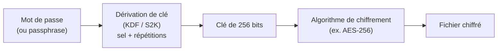

<!--
Version : 5.5
Date : 02/10/2026

Historique des versions (usage interne, pour le suivi de la maintenance du guide — non destiné aux lecteurs) :

| Version | Date | Modifications |
|---|---|---|
| V1.0 | 28/09/2026 | Première version complète |
| V2.0 | 28/09/2026 | Retrait de la mention de l'assistant IA (ancienne 10.3) ; restructuration de la liste Diceware (fichier téléchargeable par défaut, licence séparée, recette manuelle en <details>) ; toutes les commandes en bloc de code avec mention explicite de PowerShell ; assouplissement du ton et du fond sur le re-tirage d'une passphrase (distinction critère de catégorie / critère de contenu) ; clarification du réglage « caractères non alphabétiques » de Kleopatra |
| V3.0 | 29/09/2026 | Chemins de menus systématiquement en code ; alerte [!CAUTION] (nouvelle catégorie) ; glossaire mis en tableau ; correction de deux encadrés qui ne s'affichaient pas (dans une liste, dans un <details>) ; nuance sur le doublon du mot de passe maître dans le coffre (9.1) ; note sur la rotation du mot de passe maître ; note sur les notes sécurisées groupées pour les services courants (9.4) ; note sur l'antivirus ; dépannage KeePassXC ; corrections de cohérence (annexes B et D, lien vers 7.3) |
| V4.0 | 30/09/2026 | Deux dernières incohérences de style corrigées (annexe B, checklist) ; note sur la rotation du mot de passe reformulée en ton conseil, avec la révision 4 du NIST SP 800-63B ; nom de fichier confirmé pour le chiffrement d'un dossier (nom_du_dossier.tar.gpg, testé) ; retrait du bloc TODO ; historique des versions déplacé en commentaire caché |
| V5.0 | 30/09/2026 | Habillage visuel complet (prompt_upgrade_MD_visual) : versioning entièrement caché (repère + historique regroupés ici, en tête) avec seule la date visible sous le H1 ; sommaire replié en <details open> ; ancres explicites (#sec-N) et emoji sur les 11 grandes parties uniquement (pas les sous-parties) ; lien de retour en haut en fin de chaque grande partie ; badges sur deux lignes (licence/guide/Proton puis NanaZip/KeePassXC/Gpg4win) ; annexe A reformatée en liens propres avec justification ; pied de page aligné sur le gabarit du prompt |
| V5.3 | 01/10/2026 | Ajustements visuels ; correction des badges shield.io avec les bons logos ; verifications des liens en Annexe A ; épuration de la liste des verifications |
| V5.4 | 02/10/2026 | Factorisation complète des liens et badges en variables de référence (prompt_upgrade_MD_code) : conversion des 2 blocs de badges en `<div>`, correction du badge Guide (pointe vers le repo plutôt que le profil), ajout du lien officiel win-rar.com, toutes les URL externes et GitHub du corps et de l'annexe A regroupées en bas de fichier |
| V5.5 | 02/10/2026 | Correction de la regex de nettoyage de la liste Diceware (`^\d{5} ` à la place de `^\d+\s+`, qui pouvait fusionner des lignes), avec deux encadrés CAUTION dédiés et confirmation d'une reproduction indépendante du hash ; correction du menu NanaZip (sommes de contrôle en entrées directes, pas un sous-menu séparé) ; reformulation de la partie 5.2 sans affirmation d'audit formel de GnuPG ; versions exactes des logiciels testés précisées (Gpg4win v5.1.1, GnuPG v2.5.24, KeePassXC v2.7.12, NanaZip v7.0.1843.0) ; badge NanaZip recoloré avec le logo 7-Zip |

Reste à vérifier avant publication :
- Lier le futur guide Proton Pass (partie 9) une fois publié.
-->

<a id="top"></a>

<!-- BADGES -->
<h1 align="center">🔐 Protéger ses secrets critiques : mots de passe, passphrases et chiffrement de fichiers sous Windows</h1>

<p align="center"><sub>Dernière mise à jour : 2 octobre 2026</sub></p>

<div align="center">

[![Licence CC BY-NC-SA 4.0][badge_license]][url_license]
[![Guide : Sécurité et chiffrement][badge_guide]][github_repo]
[![Proton Pass][badge_proton]][url_proton]

</div>
<div align="center">

[![NanaZip][badge_nanazip]][github_nanazip]
[![KeePassXC][badge_keepassxc]][url_keepassxc]
[![Gpg4win / Kleopatra][badge_gpg4win]][url_gpg4win]

</div>

> **Configuration testée :** Windows 11 · Gpg4win v5.1.1 (GnuPG v2.5.24) · KeePassXC v2.7.12 · NanaZip v7.0.1843.0
>
> **Public visé :** toute personne qui veut protéger un mot de passe maître, des phrases de récupération ou des sauvegardes sensibles, sans être experte en cryptographie. Aucune connaissance préalable n'est nécessaire : les termes techniques sont expliqués au fil du texte et dans le [glossaire](#c-glossaire).

---

<!-- SOMMAIRE -->
<details open>
<summary><b>📑 Sommaire</b></summary>

1. [Introduction](#sec-1)
2. [Les notions de base (et les mythes)](#sec-2)
3. [Le mot de passe, les principes](#sec-3)
4. [Panorama des outils](#sec-4)
5. [Notre choix, Gpg4win et Kleopatra](#sec-5)
6. [Générer sa passphrase avec KeePassXC](#sec-6)
7. [Chiffrer avec Kleopatra](#sec-7)
8. [Stockage et sauvegardes](#sec-8)
9. [Hygiène du mot de passe maître et du compte](#sec-9)
10. [Méthode et réflexes](#sec-10)
11. [Annexes](#sec-11)
    - [A. Liens officiels](#a-liens-officiels)
    - [B. Tableau de synthèse](#b-tableau-de-synthèse)
    - [C. Glossaire](#c-glossaire)
    - [D. Checklist finale](#d-checklist-finale)

</details>

---

## Comment lire ce guide

Le guide suit un chemin linéaire : **comprendre → choisir ses outils → configurer → utiliser → sauvegarder**. Vous pouvez le lire d'un trait, ou aller directement à la partie qui vous intéresse grâce au sommaire.

**Niveaux de recommandation**, indiqués devant chaque réglage ou étape :

| 🚦 Niveau | Signification |
|---|---|
| 🔴 **Impératif** | À faire absolument : sans cela, la protection est nettement affaiblie. |
| 🟡 **Conseillé** | Recommandé pour un usage sensible ; peu coûteux à mettre en place. |
| 🟢 **Optionnel** | Amélioration marginale ou cas particulier ; à vous de juger. |

**Encadrés** utilisés dans le texte :

> [!IMPORTANT]
> Point essentiel à retenir.

> [!TIP]
> Astuce pratique.

> [!WARNING]
> Piège fréquent ou erreur classique.

> [!CAUTION]
> Point qui, mal compris, peut fausser le résultat ou la sécurité obtenue.

> [!NOTE]
> Précision, nuance ou contexte supplémentaire.

**Cas pratiques** : les subtilités sur les mots de passe sont volontairement déplacées dans des sections « Cas pratique » (partie 6), au moment où elles deviennent concrètes, pour ne pas alourdir la théorie.

**Testé ou documenté ?** Les résultats notés « *testé* » ont été obtenus sur la configuration indiquée en tête de ce guide. Les autres affirmations s'appuient sur la documentation officielle des outils. Les logiciels évoluent : en cas de doute, recommencez le test décrit (partie 7.6).

---

## Le chemin en bref

1. **Comprendre** que la solidité d'un fichier chiffré dépend surtout du mot de passe (parties [2](#sec-2) et [3](#sec-3)).
2. **Générer la passphrase par un tirage mécanique** (méthode Diceware, 7 mots) avec KeePassXC, sans jamais l'inventer (partie [6](#sec-6)).
3. **Configurer Kleopatra avant de l'utiliser**, en commençant par désactiver le cache de passphrase (partie [7.2](#72-régler-la-sécurité-avant-usage)).
4. **Chiffrer, puis tester le déchiffrement**, et seulement ensuite supprimer l'original en clair (partie [7.4](#74-chiffrer-un-fichier-ou-un-dossier)).
5. **Sauvegarder à froid** et conserver la passphrase critique sur **papier** (partie [8](#sec-8)).
6. **Protéger le compte du gestionnaire de mots de passe** : mot de passe maître robuste, double authentification, codes de secours (partie [9](#sec-9)).
7. **Vérifier vos outils et vos sources** : liens officiels, empreintes, tests (partie [10](#sec-10)).

---

<a id="sec-1"></a>

## 1. 🧭 Introduction

### 1.1 Pourquoi ce guide

Beaucoup de gens protègent leurs fichiers sensibles avec l'option « mot de passe » de leur logiciel d'archivage, sans savoir ce qui se passe réellement derrière : quel algorithme ? quelle dérivation de clé ? quelle robustesse pour le mot de passe lui-même ? Ce guide répond à ces questions et propose une méthode complète, testée, pour :

- **protéger un fichier ou un dossier très sensible** (par exemple une sauvegarde contenant des phrases de récupération, des codes de secours ou l'accès à un gestionnaire de mots de passe) ;
- **choisir un mot de passe maître robuste mais mémorisable** ;
- **ouvrir et vérifier des fichiers chiffrés reçus d'autres personnes** (par exemple au format `.gpg`) ;
- **le faire sur Windows, avec des outils gratuits, ouverts et durables**.

### 1.2 Ce que couvre (et ne couvre pas) ce guide

| Couvert | Non couvert |
|---|---|
| Chiffrement de fichiers et dossiers par mot de passe (symétrique) | Chiffrement du disque système entier |
| Génération et mémorisation de passphrases (méthode Diceware) | Chiffrement des e-mails et signature de messages |
| Windows 10/11 | macOS, Linux, mobiles (les principes restent valables) |
| Bonnes pratiques de stockage et de sauvegarde | Réseau, VPN, sécurité de la navigation |

### 1.3 Les trois usages qui guident ce guide

1. **Le fichier maître** : un fichier chiffré contenant vos secrets les plus critiques, stocké à froid. Sa passphrase est notée **sur papier** et n'a pas besoin d'être mémorisée.
2. **Le mot de passe maître** : celui de votre gestionnaire de mots de passe (par exemple Proton Pass). Il doit être **mémorisé** et rester robuste.
3. **Les fichiers reçus** : des fichiers chiffrés par d'autres (par mot de passe) que vous devez pouvoir ouvrir et vérifier.

> [!NOTE]
> Ce guide sera complété par un guide dédié au paramétrage de Proton Pass. Les deux se renvoient l'un à l'autre : celui-ci explique *comment fabriquer et protéger* vos secrets, l'autre *comment les utiliser au quotidien*.

<p align="right"><sub><a href="#top">⬆️</a></sub></p>

---

<a id="sec-2"></a>

## 2. 🧩 Les notions de base (et les mythes)

### 2.1 Les trois maillons d'un fichier chiffré par mot de passe

Quand vous chiffrez un fichier « avec un mot de passe », trois éléments interviennent :



1. **Le mot de passe (ou passphrase)** : c'est ce que vous saisissez.
2. **La dérivation de clé (KDF)** : une fonction qui transforme votre mot de passe en une vraie clé cryptographique, en le « mélangeant » avec une valeur aléatoire (le *sel*) et en répétant l'opération un grand nombre de fois pour **ralentir** quiconque essaierait de deviner votre mot de passe. Dans le monde OpenPGP, elle s'appelle **S2K** (*string-to-key*).
3. **L'algorithme de chiffrement** : le mécanisme qui brouille réellement le contenu (par exemple AES).

> [!IMPORTANT]
> **Une chaîne est aussi solide que son maillon le plus faible.** Les algorithmes modernes (AES-256 et consorts) sont extrêmement robustes. Le maillon faible, en pratique, est presque toujours **le mot de passe**. C'est pourquoi la moitié de ce guide lui est consacrée.

### 2.2 Chiffrement symétrique et asymétrique

| | Symétrique | Asymétrique |
|---|---|---|
| **Principe** | Une seule clé (dérivée d'un mot de passe) chiffre et déchiffre | Une paire de clés : publique (pour chiffrer) et privée (pour déchiffrer) |
| **Usage typique** | Protéger vos propres fichiers, échanger un fichier avec un mot de passe convenu | Écrire à quelqu'un sans lui communiquer de secret à l'avance |
| **Exemples** | AES, Twofish, ChaCha20 | RSA, courbes elliptiques (Ed25519, X25519) |
| **Dans ce guide** | ✅ Seul type utilisé | ❌ Non nécessaire |

Si vous n'échangez pas de clés publiques avec des correspondants, vous n'avez **pas besoin** de la gestion de clés de Kleopatra : le mode « mot de passe » suffit.

### 2.3 Le mythe des « 512 bits » ou « 1024 bits »

On croise souvent l'idée qu'un chiffrement serait « plus fort » avec une clé de 512 ou 1024 bits. Pour le **chiffrement symétrique** (celui qui protège vos fichiers), c'est faux :

- **AES**, **Twofish**, **Serpent**, **Camellia** acceptent des clés de 128, 192 ou 256 bits. **256 bits est le maximum**.
- **ChaCha20 / XChaCha20** utilisent également une clé de 256 bits.
- Fournir une clé plus longue que ce que l'algorithme attend n'apporte aucun gain : elle est tronquée ou ignorée.
- Les grands nombres (2048, 3072, 4096 bits) que l'on voit souvent concernent **RSA**, un chiffrement **asymétrique**, dont les tailles de clé ne se comparent pas à celles des algorithmes symétriques.
- Quelques primitives peu courantes (comme *Threefish*) existent en versions 512 ou 1024 bits, mais elles ne sont pas prises en charge par les outils standards et n'offrent pas, face aux attaques connues, d'avantage pratique sur 256 bits.

> [!NOTE]
> Une clé de 256 bits représente 2²⁵⁶ possibilités, soit un nombre à 78 chiffres. Aucune machine existante ou envisageable ne peut les parcourir. Ce qui est « attaquable », c'est votre **mot de passe**, pas la clé de 256 bits.

### 2.4 Formats ouverts ou propriétaires : la question de la pérennité

Un fichier chiffré doit pouvoir être rouvert **dans dix ans**. Deux situations très différentes :

- **Format ouvert et standardisé** (par exemple OpenPGP, extension `.gpg`) : plusieurs logiciels indépendants savent le lire. Si l'un disparaît, les autres restent.
- **Format propre à un logiciel** : si le logiciel n'est plus maintenu, ou change de format entre deux versions, vous risquez de perdre l'accès.

C'est l'un des critères qui a guidé le choix des outils de ce guide (voir [partie 5](#sec-5)).

### 2.5 Et l'ordinateur quantique ?

- Contre le chiffrement symétrique, l'algorithme de Grover (la seule attaque quantique connue applicable) **réduit l'effort à la racine carrée** : AES-256 offrirait alors l'équivalent d'une clé de 128 bits, ce qui reste hors de portée.
- Le même raisonnement s'applique en théorie à la recherche d'un mot de passe : un attaquant quantique explorerait un espace de recherche de taille racine carrée. Chaque tentative reste toutefois coûteuse à calculer (dérivation de clé), et la parallélisation de cette attaque est limitée.
- **Conséquence pratique** : pour des secrets destinés à durer très longtemps, viser **7 ou 8 mots** plutôt que 6 est une marge de sécurité raisonnable (voir [partie 3](#sec-3)).

> [!NOTE]
> Il s'agit d'un ordre de grandeur, pas d'une garantie. L'informatique quantique évolue ; le principe de précaution est de garder de la marge.

### 2.6 Chiffrer une archive déjà chiffrée, utile ou non

Envelopper une archive déjà chiffrée en AES-256 dans un second chiffrement **n'ajoute pas de « force brute »** : la donnée intérieure est déjà indiscernable d'un bruit aléatoire, et la seconde couche ne multiplie pas la robustesse de la première.

Cela peut néanmoins être utile pour d'autres raisons :

- **Secrets indépendants** : si un mot de passe fuit, les autres couches protègent encore.
- **Métadonnées masquées** : la couche extérieure cache les noms et tailles des archives intérieures.

> [!TIP]
> Pour l'archive « externe » qui contient des fichiers déjà chiffrés, choisissez le mode **Stockage** (sans compression) : des données chiffrées ne se compressent pas, la compression ralentirait l'opération pour rien.

### 2.7 « Inviolable » n'existe pas

En cryptographie, aucune garantie n'est absolue. La formulation honnête est la suivante : **personne ne sait casser AES-256 aujourd'hui, et aucune voie n'est prévisible**. Ce que l'on peut maîtriser, ce sont les risques réels : mot de passe faible, mot de passe perdu, logiciel abandonné, sauvegarde unique, erreur de manipulation. C'est l'objet des parties suivantes.

<p align="right"><sub><a href="#top">⬆️</a></sub></p>

---

<a id="sec-3"></a>

## 3. 🔑 Le mot de passe, les principes

Cette partie pose les principes essentiels. Les subtilités (pièges, cas particuliers, exemples) sont volontairement renvoyées vers les **cas pratiques de la [partie 6](#sec-6)**, là où vous aurez l'outil sous les yeux.

### 3.1 L'entropie en une phrase

L'**entropie** mesure le nombre de possibilités qu'un attaquant doit réellement explorer pour retrouver votre mot de passe. Elle s'exprime en **bits** : chaque bit supplémentaire **double** le nombre de possibilités.

> [!IMPORTANT]
> **L'entropie ne dépend pas de la longueur apparente du mot de passe, mais du processus qui l'a produit.** Un mot de passe tiré au hasard dans un ensemble de N éléments équiprobables apporte log₂(N) bits. Un mot de passe *inventé par un humain* ne peut pas être mesuré ainsi : on ne connaît pas l'ensemble dans lequel il a été « tiré », et cet ensemble est presque toujours bien plus petit qu'on ne le croit.

### 3.2 La méthode Diceware en bref

**Diceware** consiste à tirer **plusieurs mots au hasard** dans une liste de **7776 mots** (soit 6⁵, ce qui correspond à cinq lancers d'un dé à six faces par mot). Chaque mot apporte :

> log₂(7776) ≈ **12,92 bits**

Le hasard doit provenir d'un **dé physique** ou d'un **générateur aléatoire cryptographique** (celui de KeePassXC, par exemple) : jamais de votre imagination.

| Nombre de mots | Entropie approximative | Usage |
|---|---|---|
| 4 | ≈ 51,7 bits | Insuffisant pour un secret important |
| 5 | ≈ 64,6 bits | Minimum pour un compte courant |
| 6 | ≈ 77,5 bits | Bon niveau pour des usages sensibles |
| **7** | **≈ 90,5 bits** | **Recommandé pour un mot de passe maître ou un fichier critique** |
| 8 | ≈ 103,4 bits | Marge supplémentaire pour des secrets de très longue durée |

### 3.3 Pour situer ces chiffres

| Mot de passe | Entropie approximative |
|---|---|
| 8 caractères aléatoires (94 symboles clavier) | ≈ 52 bits |
| 12 caractères aléatoires (94 symboles) | ≈ 79 bits |
| **7 mots Diceware** | **≈ 90 bits** |
| 18 caractères aléatoires (52 lettres) | ≈ 103 bits |
| 18 caractères aléatoires (62 caractères alphanumériques) | ≈ 107 bits |
| 18 caractères aléatoires (94 symboles) | ≈ 118 bits |

> [!NOTE]
> **Une chaîne de 18 caractères aléatoires est mathématiquement plus forte que 7 mots.** Le compromis de la méthode Diceware est ailleurs : on renonce à quelques dizaines de bits pour obtenir un secret **beaucoup plus facile à mémoriser et à taper**, tout en restant très largement au-delà de ce que l'on sait attaquer. Pour vous rapprocher d'un mot de passe de 18 lettres aléatoires (≈ 103 bits), viser 8 mots suffit.

### 3.4 Ordre de grandeur : est-ce vraiment hors de portée ?

Hypothèse volontairement très généreuse pour l'attaquant : **mille milliards d'essais par seconde**.

- 2⁹⁰ essais représentent environ **1,2 × 10²⁷** possibilités.
- À ce rythme, parcourir tout l'espace prendrait environ **39 millions d'années** (la moitié en moyenne).

En pratique, la dérivation de clé (la répétition de hachages) ralentit fortement chaque tentative : l'attaquant est loin d'atteindre ce rythme. Il s'agit d'un **ordre de grandeur** destiné à situer les chiffres, pas d'une garantie.

### 3.5 Trois règles à retenir

1. **Le hasard doit être mécanique** : dé, ou générateur cryptographique. Jamais votre choix personnel, même « au hasard » (cas pratiques [1](#cas-pratique-1-puis-je-choisir-moi-même-mes-mots-dans-la-liste) et [2](#cas-pratique-2-une-phrase-personnelle-ou-une-citation-cest-mieux-non)).
2. **La longueur doit être suffisante** : 7 mots pour l'essentiel, 6 au minimum pour les usages sensibles.
3. **Le secret doit être unique** : ne jamais réutiliser la passphrase ailleurs.

### 3.6 Deux usages, deux exigences

| | Passphrase du **fichier maître** | **Mot de passe maître** du gestionnaire |
|---|---|---|
| **Fréquence de saisie** | Rare | Régulière |
| **Où est-elle conservée ?** | **Sur papier**, dans un lieu sûr (voir [partie 8](#sec-8)) | **En mémoire** (avec une copie papier de secours) |
| **Besoin de mémorisation ?** | Non | Oui |
| **Méthode recommandée** | Tirage Diceware (7 à 8 mots) ou chaîne aléatoire pure | Tirage Diceware (7 mots) mémorisé par image mentale et répétition |

> [!TIP]
> Pour une passphrase **écrite sur papier**, Diceware reste un très bon choix : les mots sont plus faciles à recopier sans erreur qu'une longue chaîne de symboles.

<p align="right"><sub><a href="#top">⬆️</a></sub></p>

---

<a id="sec-4"></a>

## 4. 🧰 Panorama des outils

Deux familles d'outils interviennent, et il est utile de ne pas les confondre :

- **Les archiveurs** regroupent et compressent des fichiers (WinRAR, 7-Zip, NanaZip, PeaZip…). Beaucoup savent aussi protéger l'archive par mot de passe.
- **Les outils de chiffrement** se concentrent sur le chiffrement lui-même (Gpg4win/Kleopatra, EncryptPad, Picocrypt-NG, VeraCrypt…).

On peut très bien utiliser **un outil de chaque famille** : un archiveur confortable pour regrouper les fichiers, puis un outil de chiffrement dédié pour le scellement final.

### 4.1 Les archiveurs et leur chiffrement

| Format / logiciel | Chiffrement des données | Noms de fichiers chiffrés ? | Remarques |
|---|---|---|---|
| **RAR5** (WinRAR) | AES-256 (mode CBC), non configurable | Oui, en option | Format propriétaire, largement lu par d'autres outils |
| **RAR4** (ancien format de WinRAR) | AES-128 | Oui, en option | À éviter : préférer RAR5 |
| **ZIP** | AES-256 (extension WinZip) ou **ZipCrypto** | **Non** | ZipCrypto est faible : à proscrire. La case « chiffrer les noms » n'a **aucun effet** sur un ZIP |
| **7z** | AES-256 | **Oui**, en option | Format ouvert, lisible par de nombreux logiciels |

> [!WARNING]
> **Le format ZIP ne chiffre pas les noms de fichiers.** Même si un logiciel propose de cocher « chiffrer les noms », cela n'a aucun effet sur un fichier `.zip` : la liste des fichiers reste lisible sans mot de passe. Pour cacher les noms, utilisez le **7z** (ou RAR5) avec l'option de chiffrement des noms.

> [!NOTE]
> **Dans WinRAR, la case « chiffrer les noms de fichiers » ne change pas l'algorithme** qui protège les données : c'est le format d'archive choisi (RAR5 ou RAR4) qui détermine l'algorithme. Vérifiez que vos archives sont bien au format RAR5.

#### PeaZip

- Très large prise en charge de formats, open source, multiplateforme.
- Offre, sur ses formats maison (PEA, ARC), des algorithmes supplémentaires (Twofish, Serpent) et un système de **fichier-clé** (*keyfile*) en second facteur : un vrai plus.
- **Retour d'expérience** (versions testées, non notées) : sur les formats universels (ZIP, 7z), seul AES-256 est proposé ; la case de chiffrement des noms est sans effet sur ZIP ; après une **erreur de mot de passe**, l'application a réutilisé la saisie erronée pendant la session, ce qui obligeait à la fermer et la rouvrir ; l'intégration au menu contextuel de Windows 11 et le choix des panneaux sont moins directs que dans d'autres archiveurs.
- Ces constats peuvent avoir évolué : testez la version en cours avant de vous décider.

#### NanaZip (retenu pour l'archivage courant)

- Dérivé open source de **7-Zip**, pensé pour Windows 10/11 : il hérite des fonctionnalités de 7-Zip.
- **Points forts constatés** : intégration au thème Windows (mode sombre), **menu contextuel complet et personnalisable**, calcul d'**empreinte SHA-256 ou MD5 en un clic** sur n'importe quel fichier, création d'archives 7z chiffrées (AES-256, noms chiffrés).
- **Limites** : pas de fichier-clé ; AES-256 uniquement sur les formats courants.
- Il peut parfaitement cohabiter avec WinRAR.

> [!TIP]
> Le calcul d'empreinte en un clic est très pratique pour **vérifier un téléchargement** (voir [partie 10](#sec-10)). Dans NanaZip, les sommes de contrôle (CRC-32, CRC-64, SHA-1, SHA-256…) sont des entrées du sous-menu `NanaZip` du clic droit, aux côtés des options d'ajout à l'archive.

### 4.2 Les outils de chiffrement

| Outil | Format des fichiers | Algorithmes | Dérivation de clé | Interface | À retenir |
|---|---|---|---|---|---|
| **Gpg4win / Kleopatra** (GnuPG) | OpenPGP `.gpg`, ouvert et standardisé | AES, Twofish, Camellia, CAST5, 3DES, Blowfish, IDEA | S2K itéré et salé (avec SHA) | Graphique (Kleopatra) + ligne de commande | Référence de l'écosystème OpenPGP ; **pas d'Argon2** |
| **EncryptPad** | OpenPGP `.gpg` (et `.epd`) | AES, Camellia, Twofish, CAST5, 3DES | S2K itéré et salé | Graphique, type éditeur de texte | Plus simple ; ne chiffre pas un dossier directement |
| **Picocrypt-NG** | Format propre `.pcv` | XChaCha20 (mode « Paranoid » : cascade avec Serpent) | **Argon2id** | Graphique, très simple | Moderne et léger ; **dépend du logiciel** pour rouvrir |
| **Kryptor** | Format propre | Suite fixe moderne | Argon2id | Ligne de commande | **Aucune option de configuration** ; changements de format entre versions majeures |
| **VeraCrypt** | Volumes chiffrés (conteneurs ou partitions) | AES, Serpent, Twofish, Camellia, Kuznyechik, et cascades | PBKDF2 ; **Argon2id** ajouté en juin 2026 pour les volumes non système | Graphique | Très configurable ; **nécessite VeraCrypt** pour monter le volume |
| **age** | Format propre | X25519 + ChaCha20-Poly1305 | scrypt (mode mot de passe) | Ligne de commande | Simple et moderne ; pas d'interface graphique |

> [!NOTE]
> Ce tableau reflète l'état des outils en septembre 2026, d'après leurs pages officielles. Vérifiez les versions actuelles avant de vous décider. Les informations sur **age** sont issues de la documentation générale du projet et n'ont pas été retestées pour ce guide.

**Précisions utiles**

- **EncryptPad** : ses algorithmes de chiffrement (TripleDES, CAST5, AES, AES192, AES256, Camellia128/192/256, Twofish) et son format OpenPGP standard sont décrits dans sa documentation officielle. Il utilise le S2K classique, donc ni Argon2 ni ChaCha20.
- **Picocrypt** : le projet **original** a été **archivé** par son auteur. **Picocrypt-NG** en est une continuation communautaire, **active** (versions publiées en 2026). Écrivez toujours « NG » pour ne pas confondre les deux.
- **Kryptor** : d'après sa documentation, il est volontairement dépourvu d'options de configuration, et sa version 4.0.0 a introduit des changements incompatibles avec les précédentes. C'est un point à considérer si votre critère est de rouvrir vos fichiers dans dix ans.
- **VeraCrypt** : depuis la version 1.26.29 (juin 2026), il propose Argon2id pour les volumes non système. Son inconvénient, pour notre usage, reste qu'un volume ne se monte qu'avec VeraCrypt.

### 4.3 Pourquoi il n'existe pas de « PeaZip du chiffrement »

Il est naturel de chercher un outil unique qui offrirait **tous** les algorithmes, **toutes** les dérivations de clé et **tous** les formats. Il n'existe pas vraiment, et ce n'est pas un hasard :

- **Les outils modernes font le choix inverse** : peu d'options, mais toutes solides. Trop de choix multiplie les erreurs de configuration (par exemple choisir un algorithme ancien « parce que ça sonne robuste »).
- **L'écosystème très flexible (OpenPGP) est plus ancien** et évolue lentement : il offre du choix, mais avec des dérivations de clé plus classiques.
- **Maintenir** une interface complète avec des dizaines d'algorithmes et de formats est un travail considérable.

On doit donc arbitrer entre **liberté de choix**, **modernité**, **pérennité du format** et **simplicité**. Les deux parties suivantes expliquent l'arbitrage retenu.

### 4.4 Le critère décisif : pouvoir rouvrir ses fichiers dans dix ans

Trois questions à se poser pour chaque outil :

1. **Le format est-il ouvert**, lisible par plusieurs logiciels indépendants ?
2. **Le projet est-il largement utilisé et maintenu**, de sorte qu'il existera encore et qu'on y trouvera de l'aide ?
3. **Pouvez-vous ouvrir les fichiers que d'autres vous envoient** (format standard) ?

Selon ces critères, les outils à format propre (Picocrypt-NG, Kryptor, age) et ceux qui exigent leur propre logiciel pour monter un volume (VeraCrypt) sont excellents sur certains points, mais moins bien placés sur celui-ci.

<p align="right"><sub><a href="#top">⬆️</a></sub></p>

---

<a id="sec-5"></a>

## 5. ✅ Notre choix, Gpg4win et Kleopatra

### 5.1 Le choix

Pour protéger un fichier maître et ouvrir les fichiers reçus, ce guide retient **Gpg4win** (qui inclut **Kleopatra**, l'interface graphique de **GnuPG**), en mode **chiffrement symétrique par mot de passe**.

### 5.2 Pourquoi ce choix

C'est le choix de la **fiabilité dans la durée**, pas celui de la nouveauté cryptographique. Les raisons :

1. **Format ouvert et standardisé.** Les fichiers `.gpg` suivent le standard OpenPGP : plusieurs logiciels indépendants peuvent les lire. Vous ne dépendez pas d'un seul programme.
2. **Implémentation de référence.** GnuPG est **le logiciel de référence** de l'écosystème OpenPGP, développé depuis 1999 et maintenu par une équipe professionnelle (g10 Code GmbH). Gpg4win en est la distribution officielle pour Windows, développée à l'origine pour le compte de l'agence allemande de cybersécurité (BSI).
3. **Longévité et usage massif comme infrastructure critique.** Son code source est ouvert depuis plus de vingt ans, et il sert de brique de base à des systèmes critiques comme la vérification des paquets de nombreuses distributions Linux (Debian notamment). Aucun audit de sécurité indépendant et formel portant sur l'ensemble du code n'est publiquement documenté à ce jour — une fondation dédiée au financement d'audits open source (OSTIF) le listait d'ailleurs comme objectif non atteint. **Ce qui reste solide, c'est l'examen continu par une très large communauté sur une longue durée, pas un rapport d'audit ponctuel.**
4. **Compatibilité avec ce qu'on vous envoie.** Vous pouvez déchiffrer les fichiers `.gpg` protégés par mot de passe que d'autres personnes vous transmettent, quel que soit l'outil qu'elles ont utilisé.
5. **Choix d'algorithmes.** Kleopatra applique par défaut AES-256 ; d'autres algorithmes (Twofish, Camellia…) sont disponibles en ligne de commande.
6. **Interface graphique intégrée à Windows** (clic droit dans l'Explorateur).

> [!IMPORTANT]
> **« Audité » ne veut pas dire « infaillible ».** Des vulnérabilités sont découvertes et corrigées régulièrement dans tous les logiciels, GnuPG compris. C'est pourquoi il faut **garder Gpg4win à jour** et tester ses paramètres. Ce guide n'a pas réalisé d'audit lui-même : il s'appuie sur l'ancienneté, l'ouverture du code, l'ampleur de la communauté et le statut de référence de l'outil.

### 5.3 Ce que ce choix implique (et ses limites)

| Point | Détail |
|---|---|
| **Pas d'Argon2 ni de ChaCha20** | Ce sont des choix de conception du standard OpenPGP tel que suivi par GnuPG (voir [7.7](#77-limites-et-pourquoi-pas-argon2)). Votre protection repose donc sur **la robustesse de la passphrase**, d'où l'importance de la partie 6. |
| **Pas de menu « choisir l'algorithme »** | Kleopatra applique les réglages par défaut de GnuPG (AES-256). Modifier certains paramètres passe par un fichier de configuration (voir [7.3](#73-durcissement-optionnel-du-s2k-mesurer-avant-de-modifier)). |
| **Fichier opaque** | Un fichier `.gpg` est un bloc unique : on ne peut pas y « ajouter » un fichier. Il faut déchiffrer, modifier, puis rechiffrer (voir [8.4](#84-mettre-à-jour-un-fichier-déjà-chiffré)). |

### 5.4 Alternative simple : EncryptPad

**EncryptPad** produit lui aussi des fichiers OpenPGP standard, avec une interface plus simple, orientée chiffrement par mot de passe. C'est une bonne alternative si Kleopatra vous paraît trop lourd. Elle reste un projet plus modeste que GnuPG. Les fichiers restent lisibles par Gpg4win : vous n'êtes donc pas enfermé.

> [!NOTE]
> Ni Kleopatra ni EncryptPad ne sont des archiveurs. Pour un dossier, Kleopatra propose de le regrouper en archive `tar` avant chiffrement ; EncryptPad demande de le compresser au préalable (avec NanaZip, par exemple).

### 5.5 Et si vous préférez Picocrypt-NG ou un autre outil

Vous en avez parfaitement le droit, et **l'essentiel de ce guide reste valable** :

> [!IMPORTANT]
> **La logique des passphrases (parties 3 et 6) ne dépend pas de l'outil.** Une passphrase Diceware générée avec KeePassXC protège aussi bien un fichier Picocrypt-NG qu'un fichier GPG. De même, **l'hygiène** (parties 8, 9 et 10 : sauvegardes à froid, carnet papier, double authentification, vérification des sources) reste identique.

Ce qui change avec un outil à format propre :

- **La pérennité repose sur l'outil** : conservez une copie de l'installateur officiel, sa version et sa documentation avec vos sauvegardes.
- **La compatibilité** : les fichiers ne s'ouvriront qu'avec cet outil (ou ses forks).
- **Les réglages** se trouvent dans l'outil lui-même : lisez sa documentation officielle.

<p align="right"><sub><a href="#top">⬆️</a></sub></p>

---

<a id="sec-6"></a>

## 6. 🎲 Générer sa passphrase avec KeePassXC

**KeePassXC** est un gestionnaire de mots de passe libre et gratuit. Ici, nous n'utilisons que son **générateur de passphrase**, qui peut fonctionner avec une liste de mots personnalisée, **hors ligne**, avec un générateur aléatoire cryptographique. Vous n'avez pas besoin de créer une base de données pour cela.

### 6.1 Installer KeePassXC

- Site officiel : <https://keepassxc.org> (page de téléchargement : <https://keepassxc.org/download/>)
- Dépôt officiel : <https://github.com/keepassxreboot/keepassxc>

> [!WARNING]
> Des sites tiers proposent de faux installateurs. Téléchargez **uniquement** depuis les liens officiels ci-dessus et vérifiez l'empreinte si elle est publiée (voir [partie 10](#sec-10)).

### 6.2 Précautions avant de générer

- 🟡 **Générez sur une machine de confiance**, à jour, idéalement sans logiciel douteux. Une passphrase générée sur un ordinateur compromis est compromise.
- 🟡 **Ne conservez pas la passphrase dans un fichier non chiffré** (bloc-notes, document texte).
- 🟡 **Videz le presse-papiers** après avoir collé la passphrase. Si l'historique du presse-papiers de Windows est activé (touches **Windows + V**), la passphrase peut y rester : désactivez cette fonction ou effacez l'historique.

### 6.3 Obtenir la liste de mots (Diceware en français)

La liste utilisée ici est la liste Diceware française de **Matthieu Weber** : **7776 mots**, un par ligne, dans l'ordre des lancers de dés.

- Source originale : <http://weber.fi.eu.org/software/diceware/src/francais.wordlist.asc>
- Fichier : [`francais.wordlist.asc`][github_diceware_fr_asc]

**Téléchargement direct (prêt à l'emploi).** Pour vous éviter la manipulation de nettoyage ci-dessous, une version déjà nettoyée (7776 mots, sans numéros) est fournie avec ce guide :

- Fichier : [`francais.wordlist.txt`][github_diceware_fr]
- Détail de la licence et de l'attribution de ce fichier : [`francais.wordlist_licence.txt`][github_diceware_fr_licence]

> [!NOTE]
> Ce fichier reste une version nettoyée de la liste de Matthieu Weber : la mention de licence et d'attribution complète se trouve dans le fichier `_licence` ci-dessus, pas dans la liste elle-même (voir plus bas pourquoi).

**Vérifier le fichier téléchargé.** Dans PowerShell, dans le dossier où vous l'avez enregistré :

```powershell
# Nombre de lignes : doit afficher 7776
(Get-Content .\francais.wordlist.txt).Count

# Empreinte SHA-256 du fichier
Get-FileHash -Algorithm SHA256 .\francais.wordlist.txt
```

Cette recette a été **reproduite indépendamment** à partir du fichier original, et le résultat obtenu correspond exactement à l'empreinte ci-dessous — un bon signe que la méthode est fiable et reproductible par n'importe qui.

L'empreinte de la version de référence de ce guide (7776 mots, **sans numéros**, fins de ligne LF, ASCII, **sans retour à la ligne après le dernier mot**, 44 809 octets) est :

```
SHA-256 : 9f6e8d4845ff178cdfe8215976adeaab9e9ebaa88ab2e8ca4de14cc7a1e1989c
```

(PowerShell affiche l'empreinte en majuscules : la comparaison ne tient pas compte de la casse.)

> [!NOTE]
> Si votre empreinte diffère, la cause la plus fréquente est un détail d'enregistrement (fins de ligne CRLF au lieu de LF, ligne vide finale, en-tête restant). Le **nombre de lignes (7776)** et l'**absence de doublons** sont les vérifications essentielles pour la sécurité : un fichier qui en diffère fausserait le tirage. Cette recette n'a pas encore été reproduite par une seconde personne à partir du fichier original.

> [!IMPORTANT]
> **Ne modifiez pas le contenu de la liste** (n'ajoutez pas d'en-tête, de commentaire ou de ligne vide) : KeePassXC traiterait chaque ligne comme un mot, ce qui fausserait le compte de 7776 et donc l'équiprobabilité. C'est pour cette raison que la licence et l'attribution vivent dans un fichier séparé plutôt que dans la liste elle-même.

> [!CAUTION]
> Le fichier original de Matthieu Weber contient, devant chaque mot, un **numéro à cinq chiffres** (le résultat des dés), et éventuellement des lignes d'en-tête ou de signature. KeePassXC attend une liste **simple : un mot par ligne, sans numéro**. C'est ce nettoyage que fait déjà la version proposée au téléchargement ci-dessus.

<details>
<summary>Vous préférez ne pas nous faire confiance et fabriquer vous-même le fichier ? Dépliez cette section.</summary>

**Recette de nettoyage (avec Notepad++)**

1. Téléchargez le fichier depuis la source originale ci-dessus.
2. Ouvrez-le dans Notepad++.
3. Supprimez les éventuelles lignes d'en-tête et de pied (signature PGP).
4. `Recherche` → `Remplacer` (Ctrl + H), mode de recherche `Expression régulière` :

   ```
   ^\d{5} 
   ```

<table><tr><td>
⚠️ <b>Attention :</b> <br>
Vérifiez bien qu'il y a un <b>espace après <code>^\d{5}</code></b>, à la fin de cette expression. Sans lui, chaque mot garde un espace parasite en début de ligne. <br>
Copiez le bloc ci-dessus plutôt que de le retaper à la main, pour ne pas l'oublier.
</td></tr></table>

<table><tr><td>
⚠️ <b>Attention :</b> <br>
N'utilisez surtout pas <code>^\d+\s+</code> : le <code>\s</code> y inclut le retour à la ligne, ce qui peut fusionner deux lignes entre elles sur certaines entrées <br>
(vérifié : ça fait passer la liste de 7776 à 7575 lignes).
</td></tr></table>

   - Remplacer par : *(vide)*
   - Cliquez sur `Remplacer tout`.
5. Enregistrez sous `francais.wordlist.txt`.
6. Vérifiez le résultat avec les commandes PowerShell ci-dessus, et comparez l'empreinte à celle donnée plus haut : elle doit correspondre exactement à la version fournie avec ce guide.

<table><tr><td>

💡 **Astuce.** Vous pouvez aussi utiliser la sélection en colonne (Alt + glisser) dans Notepad++ pour effacer la colonne des numéros. Le résultat doit être le même.

</td></tr></table>

</details>

### 6.4 Importer la liste dans KeePassXC

Les libellés exacts peuvent varier selon la version et la langue de KeePassXC.

1. Ouvrez KeePassXC (sans base de données ouverte, le générateur reste accessible depuis le menu `Outils`).
2. Ouvrez le `Générateur de mots de passe`.
3. Choisissez l'onglet `Phrase de passe` (*Passphrase*).
4. À côté du menu déroulant de la liste de mots, cliquez sur le bouton `+` pour ajouter une liste personnalisée, puis sélectionnez `francais.wordlist.txt`.

> [!TIP]
> Si le fichier n'apparaît pas ou semble vide une fois sélectionné, vérifiez deux choses : qu'il ne s'appelle pas en réalité `francais.wordlist.txt.txt` (extensions cachées par Windows), et qu'il a bien été enregistré en texte brut (pas au format `.rtf` ou `.docx`).

### 6.5 Générer la passphrase

Réglages suggérés :

| Réglage | Valeur | Remarque |
|---|---|---|
| **Nombre de mots** | **7** (6 au minimum) | 8 pour des secrets de très longue durée |
| **Séparateur** | Un caractère (tiret, espace, point…) | Facilite la lecture. Kleopatra exige au moins un caractère non alphabétique dans la passphrase (voir [7.2](#72-régler-la-sécurité-avant-usage)) ; un séparateur suffit à le satisfaire |
| **Casse** | Au choix | Une transformation **déterministe** (tout en minuscules, majuscule initiale…) **n'ajoute pas d'entropie** ; elle sert seulement à respecter les règles d'un site |

**Comment décider quand relancer le générateur.** Le plus simple est d'accepter le tout premier tirage, tel quel. Vous pouvez aussi préférer un tirage composé uniquement de vrais mots (sans les entrées de remplissage de la liste, voir [cas pratique 4](#cas-pratique-4-les-entrées-bizarres-de-la-liste-et-le-re-tirage)) : c'est parfaitement défendable, et le coût en sécurité est négligeable. Ce qui compte, c'est de **choisir votre critère avant de regarder le résultat**, et de vous y tenir une fois qu'un tirage le satisfait — sans relancer ensuite parce qu'un mot particulier vous plaît plus ou moins.

L'indicateur d'entropie de KeePassXC doit afficher environ **90 bits** pour 7 mots tirés dans une liste de 7776 mots.

### 6.6 Mémoriser sa passphrase

Une passphrase tirée au hasard n'a pas de sens : le cerveau la retient mal **si on le laisse faire tout seul**. Trois techniques combinées la rendent facile à retenir :

1. **Une image mentale personnelle et absurde.** Reliez les mots par une petite scène improbable (« un tigre mange du fromage sous un nuage »). Ne l'écrivez nulle part et ne la racontez à personne : c'est **votre** ancre, et elle ne réduit en rien l'entropie, car la scène n'est pas le mot de passe.
2. **La répétition espacée.** Saisissez-la de mémoire plusieurs fois le premier jour, puis chaque jour pendant une semaine.
3. **La mémoire musculaire.** Après quelques jours d'usage réel, les doigts la « connaissent », comme un code de carte bancaire.

> [!TIP]
> Ne craignez pas d'oublier à tout jamais : votre **copie papier de secours** (voir [partie 8](#sec-8)) est là pour ça. Cette sécurité permet de choisir une passphrase robuste sans céder à la tentation de « simplifier ». Et si un tirage composé uniquement de vrais mots vous aide à la mémoriser plus vite, c'est un choix tout à fait légitime (voir [cas pratique 4](#cas-pratique-4-les-entrées-bizarres-de-la-liste-et-le-re-tirage)).

---

### Cas pratique 1, puis-je choisir moi-même mes mots dans la liste

**La question.** « Si je pioche moi-même 6 ou 7 mots dans la liste, sans lien entre eux, est-ce aussi bon que le tirage du logiciel ? »

**La réponse : non.** « Sans rapport logique » et « équiprobable » sont deux propriétés différentes, et c'est la seconde qui fait la sécurité.

Quand vous choisissez consciemment, votre cerveau :

- **écarte** les entrées qui lui semblent laides, triviales ou bizarres (les chiffres, les symboles, les abréviations de la liste) ;
- **favorise** des mots qui lui plaisent, lui sont familiers ou « sonnent bien » ;
- converge, comme la plupart des gens, vers un **sous-ensemble restreint** de la liste.

Résultat : votre espace de choix réel n'est plus de 7776 entrées équiprobables, mais peut-être de quelques centaines. Même en se limitant aux mots de la liste, chaque mot peut perdre plusieurs bits, soit une vingtaine de bits ou plus sur l'ensemble (estimation illustrative, non mesurée). Et « j'aime les mots rares » est justement un **biais identifiable** qu'un attaquant peut prendre en compte.

> [!IMPORTANT]
> Aucune stratégie consciente (« je prends un mot par tranche de la liste », « je pointe au hasard sur l'écran ») ne produit un tirage uniforme : ce sont des heuristiques déterministes. La psychologie cognitive montre de manière constante que les séquences « aléatoires » produites par des humains sont reconnaissables comme telles. C'est pourquoi le hasard doit venir d'un **processus externe à votre jugement** : un dé, ou un générateur cryptographique.

---

### Cas pratique 2, une phrase personnelle ou une citation, c'est mieux, non

**La question.** « Une longue phrase de mon cru, avec des chiffres et de la ponctuation, facile à retenir, ne vaut-elle pas mieux que des mots aléatoires ? »

**Pourquoi c'est un piège.** Une phrase suit la grammaire et le vocabulaire d'une langue : à chaque position, le nombre de mots plausibles est **bien plus petit** que dans une liste de 7776 mots équiprobables. Les outils d'attaque modernes exploitent précisément cela (dictionnaires de proverbes et de citations, variations automatiques, modèles de langue). Et plus la phrase est « jolie » et signifiante, plus elle est prévisible.

**Exemples et estimations.** Le tableau ci-dessous classe cinq phrases, de la plus faible à la moins faible. Les chiffres sont des **plafonds estimés à la louche**, pas des mesures : leur seul but est de montrer l'écart avec les **≈ 90 bits mesurables** d'une passphrase Diceware.

| Phrase (exemple) | Pourquoi elle est faible | Plafond estimé |
|---|---|---|
| « Le sens de la vie, de l'univers et de tout le reste est 42 ! » | Référence culturelle parmi les plus célèbres, présente dans toutes les listes ciblant un public technique | ≈ 10–20 bits |
| « Espace, frontière de l'infini. C'est dans l'immensité de l'espace que réside le mystère de ce que nous sommes. » | Reformulation très proche d'une phrase d'ouverture mondialement connue ; les règles de variation automatique la retrouvent | ≈ 15–30 bits |
| « Exister, c'est avoir à être ce que l'on est, disait Sartre. » | Nom d'une personne célèbre + forme « maxime attribuée » : format visé par les dictionnaires de citations | ≈ 20–35 bits |
| « Les Borgs sont redoutables, néanmoins seule l'espèce 8472 leur a longtemps résisté. Cela mérite le respect ! » | Vocabulaire propre à une grande franchise (wikis de fans exhaustifs), même si la phrase n'est pas une citation | ≈ 30–45 bits |
| « Comme le disait un personnage de cette série, nous sommes une partie de l'univers qui tente de se comprendre lui-même. » | Œuvre plus confidentielle, mais l'idée **recoupe une citation très célèbre venue d'ailleurs** | ≈ 35–50 bits |
| **7 mots Diceware** | Tirage uniforme, sans lien avec vous | **≈ 90 bits** |

Trois enseignements :

1. **Une œuvre confidentielle ne suffit pas.** Une idée exprimée « à sa façon » peut recouper, sans qu'on le sache, une formule célèbre issue d'une tout autre source.
2. **Nommer une personne ou un terme emblématique** (un personnage, une espèce, un philosophe) donne à l'attaquant un point d'ancrage très efficace.
3. **La ponctuation, les chiffres et les majuscules aident peu** si la structure reste une phrase de langage naturel.

**Risque supplémentaire : le lien avec vous.** Une phrase construite autour de vos goûts **est liée à votre personne**. Quelqu'un qui vous connaît, ou qui retrouve une trace publique de votre affection pour une œuvre (avis, forum, réseau social), part avec un avantage qu'aucune passphrase tirée au hasard ne lui donne. Si vous envisagez tout de même une phrase perso, demandez-vous au moins : *ai-je déjà associé cette œuvre à mon identité, publiquement ou auprès de proches ?*

**Ce que valent les outils de test en ligne.**

- Le testeur de force de Bitwarden (bibliothèque **zxcvbn**) a jugé « fort » des phrases françaises devinables lors de nos essais. D'après sa documentation, ses dictionnaires sont surtout **anglophones** : il est aveugle à beaucoup de mots, proverbes et références françaises.
- À l'inverse, un calculateur purement mathématique comme **entrocalc** suppose que chaque caractère est tiré au hasard : il **surestime** toute phrase écrite par un humain.
- Aucun outil gratuit ne juge correctement une phrase « qui a du sens » dans une langue donnée. La bonne méthode est de **ne pas dépendre du verdict d'un outil**, mais d'un procédé dont la robustesse est **garantie par construction** : le tirage aléatoire.

> [!WARNING]
> **Ne saisissez jamais votre vraie passphrase dans un outil en ligne**, même réputé et même s'il annonce fonctionner dans le navigateur. Testez, si vous le souhaitez, une version factice de même structure.

> [!TIP]
> **Compromis possible** si vous tenez à une phrase personnelle pour la mémorisation : insérez **un ou deux mots tirés au hasard** (avec KeePassXC) à une position fixe que vous seul connaissez. L'entropie garantie est alors celle des mots aléatoires seuls (≈ 12,9 bits par mot) ; la partie « personnelle » n'est **pas** comptée. Ce n'est donc pas équivalent à 7 mots : privilégiez d'abord la méthode Diceware complète.

---

### Cas pratique 3, agrandir la liste ou fabriquer sa propre liste

**Une liste plus grande augmente-t-elle l'entropie ?** Oui, mathématiquement, mais très peu.

L'entropie par mot vaut log₂(N) : il faut **doubler** la liste pour gagner **un seul bit** par mot.

| Taille de la liste | Entropie par mot |
|---|---|
| 7 776 mots | ≈ 12,9 bits |
| 15 552 mots (×2) | ≈ 13,9 bits (+1) |
| 31 104 mots (×4) | ≈ 14,9 bits (+2) |

Ajouter **un mot de plus** à la passphrase rapporte **≈ 12,9 bits** d'un coup. Et une très grande liste oblige à puiser dans un vocabulaire rare, long ou ambigu (orthographes multiples, mots que l'on connaît mal), ce qui augmente les risques d'erreur de frappe ou de souvenir. **Le bon levier est donc le nombre de mots, pas la taille de la liste.**

**Puis-je fabriquer ma propre liste ?** Oui, à condition de respecter quelques règles :

- **Taille fixe et connue** (elle détermine l'entropie).
- **Aucun doublon** (même avec des variantes de casse ou d'accents) : un doublon réduit silencieusement la taille réelle.
- **Sélection 100 % mécanique**, sans jamais intervenir dans le choix ni relancer parce que le résultat ne vous plaît pas.
- **Avec des dés physiques**, la taille de la liste doit être une puissance de 6 (6⁴ = 1296, 6⁵ = 7776). Avec KeePassXC, n'importe quelle taille convient.

> [!NOTE]
> **Principe de Kerckhoffs :** la sécurité ne doit reposer que sur le secret de la clé (ici, *quels* mots ont été tirés), pas sur le secret de la liste. Supposez qu'un attaquant peut connaître votre liste exacte : c'est le tirage qui protège.

---

### Cas pratique 4, les entrées bizarres de la liste et le re-tirage

**« Il y a des mots qui n'en sont pas ! »** C'est normal. Une liste Diceware doit compter **exactement 7776 entrées**, mais une langue n'a pas assez de mots courts et courants pour les remplir. Les dernières cases sont donc complétées par des chaînes très courtes : abréviations, lettres, chiffres, symboles.

Mesures sur la liste de référence de ce guide :

- **7776 entrées**, toutes distinctes, en minuscules et en ASCII ;
- longueur de **1 à 6 caractères**, **4,76 caractères en moyenne** ;
- **201 entrées sont des nombres** et **240 ne contiennent aucune lettre** (par exemple `=`, `:-)`, `!!!`), soit environ 3 % de la liste.

**Conséquence.** Environ **une passphrase de 7 mots sur cinq** (19,7 %) contient au moins une entrée sans lettre (17,1 % pour 6 mots). C'est parfaitement normal, et **ce n'est pas un défaut à corriger à tout prix** : c'est vous qui décidez si ça vous convient.

**Peut-on relancer le générateur ? Oui, à une condition : que ce soit sur un critère de catégorie, jamais sur le contenu.**

Il y a une différence essentielle entre ces deux attitudes, même si, de l'extérieur, personne ne peut jamais savoir laquelle vous avez suivie :

- **Un critère de catégorie**, décidé avant de regarder le tirage et appliqué à l'identique quel que soit le résultat : « je ne veux aucune entrée dépourvue de lettre », « je ne veux que des mots purement alphabétiques (sans chiffre ni symbole) », « je refuse une passphrase de moins de 30 caractères ». Le coût de ce genre de filtre est calculable et, dans tous les cas ci-dessous, négligeable.
- **Un critère de contenu**, qui juge un mot particulier une fois qu'on l'a sous les yeux : « celui-ci ne me plaît pas », « cette suite ne sonne pas bien ». Là, aucune limite : chaque relance vous rapproche un peu plus du sous-ensemble de mots qui vous est personnellement agréable, exactement le biais décrit au [cas pratique 1](#cas-pratique-1-puis-je-choisir-moi-même-mes-mots-dans-la-liste). Et comme ce choix reste invisible de l'extérieur, c'est à vous seul de vous y tenir honnêtement.

**Ce que coûtent, en pratique, les filtres de catégorie les plus courants** (mesuré sur la liste de ce guide, pour 7 mots) :

| Filtre appliqué | Entrées conservées | Entropie résultante | Coût par rapport à 90,47 bits |
|---|---|---|---|
| Aucun (tirage brut) | 7776 | 90,47 bits | — |
| Exclure les entrées sans aucune lettre (`=`, `:-)`, `!!!`…) | 7536 | 90,16 bits | ≈ 0,32 bit |
| Exclure toute entrée contenant un chiffre ou un symbole (mots purement alphabétiques) | 7436 | 90,02 bits | ≈ 0,45 bit |

Un mot de passe qui doit être **mémorisé au quotidien** (votre mot de passe maître, par exemple) est précisément le cas où ce genre de filtre a le plus de sens : il rend chaque mot plus facile à lire, à épeler et à retaper, pour un coût de sécurité qui reste très inférieur à l'imprécision de nos propres estimations. Pour une passphrase **uniquement destinée à être recopiée depuis du papier** (le fichier maître, [partie 3.6](#36-deux-usages-deux-exigences)), le tirage brut, sans aucun filtre, est tout aussi bien adapté.

> [!IMPORTANT]
> **Le critère qui compte n'est pas « ai-je relancé », mais « sur quoi ».** Une règle de catégorie, fixée avant de regarder le résultat et appliquée telle quelle, ne coûte presque rien. Juger le contenu une fois qu'on l'a sous les yeux, même un peu, rouvre une porte sans fond.

**Attention à la longueur minimale.** Certains réglages (par exemple celui de Kleopatra, voir [7.2](#72-régler-la-sécurité-avant-usage)) refusent une passphrase trop courte **en nombre de caractères**, sans tenir compte de l'entropie. Comme les mots de la liste sont courts, une passphrase de 6 mots peut être valide (77 bits) mais jugée « trop courte ». Simulation sur cette liste, pour un minimum de 30 caractères :

| Passphrase | Part des tirages refusés |
|---|---|
| 6 mots, **avec** séparateur d'un caractère | ≈ 10,5 % |
| 6 mots, **sans** séparateur | ≈ 59 % |
| 7 mots, **avec** séparateur | ≈ 0,4 % |
| 7 mots, **sans** séparateur | ≈ 13 % |

D'où la recommandation : **7 mots avec un séparateur**, ou un minimum de longueur adapté au nombre de mots.

<p align="right"><sub><a href="#top">⬆️</a></sub></p>

---

<a id="sec-7"></a>

## 7. 🔒 Chiffrer avec Kleopatra

> [!IMPORTANT]
> **Ordre à respecter : régler d'abord, utiliser ensuite.** Un logiciel de chiffrement aux réglages par défaut peut mémoriser votre passphrase, en accepter une trop faible ou déléguer sa saisie à d'autres programmes. On commence donc par la configuration (7.2 et 7.3), puis on chiffre (7.4).

### 7.1 Installer Gpg4win

- Site officiel : <https://www.gpg4win.org/>
- Gpg4win regroupe **GnuPG** (le moteur), **Kleopatra** (l'interface) et **GpgEX** (l'intégration au clic droit de l'Explorateur).
- Gardez au minimum **Kleopatra**, **GnuPG** et l'intégration à l'Explorateur.
- 🟡 Si le site publie une empreinte ou une signature du fichier d'installation, **vérifiez-la** avant de l'exécuter (voir [partie 10](#sec-10)).

> [!NOTE]
> Ce guide a été testé avec Gpg4win 5.x, qui embarque GnuPG 2.5.24. Les menus d'anciennes versions peuvent différer.

### 7.2 Régler la sécurité avant usage

**Où ?** Dans Kleopatra : `Paramètres` → `Configurer Kleopatra` → `Système GnuPG`, onglet `Clefs privées` (section « Options contrôlant la sécurité »).

| Réglage (libellé français) | Valeur conseillée | Niveau | Ligne écrite dans `gpg-agent.conf` |
|---|---|---|---|
| `oublier les codes personnels après N secondes` | **1** | 🔴 Impératif | `default-cache-ttl 1` |
| `définir la durée maximale du cache de code personnel à N secondes` | **1** | 🟡 Conseillé | `max-cache-ttl 1` |
| `ne pas autoriser l'utilisation de cache de mot de passe externe` | Coché | 🟡 Conseillé | `no-allow-external-cache` |
| `interdire à l'appelant de remplacer le PIN-entry` | Coché | 🟡 Conseillé | `no-allow-loopback-pinentry` |
| `définir la taille minimale des nouvelles phrases secrètes à N` | 30 (voir remarque) | 🟡 Conseillé | `min-passphrase-len 30` |
| `nécessiter au moins N caractères non alphabétiques pour les nouvelles phrases secrètes` | 1 (valeur par défaut) | 🟢 Optionnel | *(non écrit tel quel dans `gpg-agent.conf` sur la configuration testée ; réglage propre à Kleopatra)* |
| `laisser la saisie du code personnel capturer le clavier et la souris` | Au choix | 🟢 Optionnel | — |

Cliquez ensuite sur `Appliquer` puis `OK`. Kleopatra recharge la configuration de l'agent : inutile de redémarrer.

**Pourquoi chaque réglage ?**

- 🔴 **Cache de passphrase à 1 seconde.** Par défaut, GnuPG garde votre passphrase **en mémoire pendant 10 minutes** environ : pendant ce délai, quiconque accède à votre session peut déchiffrer sans la connaître. Avec 1 seconde, la passphrase est **redemandée à chaque opération**.
- 🟡 **Cache externe refusé.** Empêche un autre logiciel de fournir une passphrase déjà en cache à l'agent.
- 🟡 **Remplacement du PIN-entry interdit.** Empêche un programme d'afficher sa propre fenêtre de saisie à la place de la vraie, ce qui pourrait permettre de voler la passphrase.
- 🟡 **Longueur minimale.** Un filet de sécurité contre une passphrase trop courte saisie par fatigue ou précipitation.
- 🟢 **Caractères non alphabétiques.** Ce réglage, visible dans la même fenêtre, **appartient à Kleopatra lui-même** : c'est votre installation, sur votre machine, qui refuse de créer une nouvelle passphrase composée uniquement de lettres, sans espace, tiret ou chiffre. Ce n'est ni un site web, ni un service en ligne : c'est un garde-fou local. Réglé sur 1 par défaut, il passe inaperçu dès que vous utilisez un séparateur entre les mots (un tiret ou un espace le satisfait), et ne concerne donc en pratique que les passphrases collées sans aucune séparation.

> [!WARNING]
> **Ces deux réglages sont locaux à votre installation de Kleopatra, pas des règles d'un site externe.** Un service en ligne (banque, messagerie…) impose ses propres règles de mot de passe, indépendantes de ces paramètres, et ce guide ne peut pas les anticiper.

> [!WARNING]
> **La longueur minimale compte des caractères, pas de l'entropie.** Les mots Diceware sont courts : 6 mots peuvent faire moins de 30 caractères tout en valant 77 bits. Avec **7 mots et un séparateur**, le risque de refus est d'environ 0,4 % (voir [cas pratique 4](#cas-pratique-4-les-entrées-bizarres-de-la-liste-et-le-re-tirage)). Adaptez la valeur au nombre de mots que vous utilisez.

> [!NOTE]
> **Effet de bord du réglage « PIN-entry ».** Les scripts ou outils en ligne de commande qui fournissent eux-mêmes la passphrase (mode `--pinentry-mode loopback`) cesseront de fonctionner. Sans conséquence si vous utilisez Kleopatra à la main.

> [!NOTE]
> **Réglages présents dans la même fenêtre mais sans intérêt pour un usage par mot de passe :** tout ce qui concerne SSH, la signature, le marquage de clés « de confiance », l'expiration de phrases secrètes et la réutilisation d'anciennes phrases. Laissez-les tels quels. Les deux champs de « motifs » (liste noire de phrases interdites) sont optionnels : avec une passphrase Diceware, ils sont sans objet.

**Vérifier que le réglage fonctionne.** Déchiffrez un fichier de test, puis recommencez immédiatement : la **passphrase doit être redemandée** à chaque fois. Si ce n'est pas le cas, le cache est encore actif.

**Méthode alternative : le fichier `gpg-agent.conf`**

Kleopatra écrit ces réglages dans le fichier `gpg-agent.conf`, situé dans le dossier de configuration de GnuPG. Pour trouver ce dossier, dans PowerShell :

```powershell
gpgconf --list-dirs homedir
```

Il s'agit généralement de `C:\Users\<votre_nom>\AppData\Roaming\gnupg`. Le fichier écrit par Kleopatra ressemble à ceci (configuration testée) :

```
###+++--- GPGConf ---+++###
default-cache-ttl 1
max-cache-ttl 1
no-allow-external-cache
min-passphrase-len 30
no-allow-loopback-pinentry
###+++--- GPGConf ---+++### <date et heure>
# GPGConf edited this configuration file.
# It will disable options before this marked block, but it will
# never change anything below these lines.
```

> [!WARNING]
> Comme l'indique le commentaire du fichier lui-même, **Kleopatra peut désactiver les lignes situées avant le bloc marqué** et ne touche jamais à ce qui est en dessous. Si vous éditez le fichier à la main, écrivez vos lignes **sous** le marqueur.

**Trois fichiers de configuration à ne pas confondre**

| Fichier | Rôle | Existe par défaut ? |
|---|---|---|
| `gpg-agent.conf` | Réglages de l'**agent** : cache de passphrase, règles de saisie | Créé par Kleopatra lorsque vous réglez ces options |
| `gpg.conf` | Options de **chiffrement de `gpg`** (dérivation de clé, algorithme…) | **Non** : à créer soi-même (voir [7.3](#73-durcissement-optionnel-du-s2k-mesurer-avant-de-modifier)) |
| `common.conf` | Options communes à plusieurs composants | Oui : à laisser tel quel |

---

### 7.3 Durcissement optionnel du S2K, mesurer avant de modifier

🟢 **Cette partie est optionnelle.** Avec une passphrase Diceware de 7 mots, les réglages par défaut sont déjà très solides. Elle s'adresse à celles et ceux qui souhaitent **vérifier ce que fait réellement leur installation**, ou qui utilisent une machine peu puissante.

#### Comprendre : ce qu'est le S2K « itéré et salé »

Pour transformer votre passphrase en clé, GnuPG utilise par défaut le mode **S2K 3**, dit « **itéré et salé** » :

- **Salé** : une valeur aléatoire (le *sel*) est mélangée à la passphrase. Deux fichiers protégés par la même passphrase auront des clés différentes, et les tables de résultats précalculés (*rainbow tables*) deviennent inutilisables.
- **Itéré** : l'ensemble « sel + passphrase » est haché **en boucle** jusqu'à avoir traité un grand nombre d'octets (le *count*). Cela **ralentit** chaque tentative d'un attaquant.
- Le **hash** est la fonction de hachage employée pour cela (SHA-1, SHA-256, SHA-512…).

#### Mesurer

**1. Le nombre d'itérations calibré par votre machine.** Dans PowerShell :

```powershell
gpg-connect-agent "GETINFO s2k_count" /bye
```

Exemple de résultat : `D 95868928`. GnuPG calibre ce nombre pour qu'une dérivation prenne environ **100 millisecondes** sur votre ordinateur. Un PC récent obtient donc un nombre plus élevé qu'un PC ancien.

**2. Ce que GnuPG a réellement utilisé, sur un fichier de test**

Chiffrez un petit fichier **sans importance** avec Kleopatra (voir 7.4), puis, dans PowerShell :

```powershell
gpg --list-packets .\fichier-test.gpg
```

> [!TIP]
> Cette commande n'a pas besoin de la passphrase. Si elle vous la demande, annulez avec **Ctrl + C**.

Exemple de sortie (configuration testée, valeurs par défaut) :

```
gpg: données chiffrées AES256.CFB
gpg: chiffré avec 1 phrase secrète
:symkey enc packet: version 4, cipher 9, aead 0, s2k 3, hash 8
        salt <valeur aléatoire>, count 65011712 (255)
```

**Lire le résultat**

| Champ | Valeur | Signification |
|---|---|---|
| `cipher` | **9** | AES-256 (confirmé par la mention « AES256.CFB ») |
| `aead` | 0 | Pas de mode AEAD : chiffrement CFB avec contrôle d'intégrité (MDC) |
| `s2k` | **3** | Mode itéré et salé |
| `hash` | **8** (*testé*) | SHA-256 |
| `hash` | **10** (*testé*) | SHA-512 |
| `hash` | 2 | SHA-1 (identifiant défini par la norme OpenPGP ; non observé lors de nos tests) |
| `count` | **65011712 (255)** | **Valeur maximale** que le format OpenPGP peut encoder |

> [!NOTE]
> **Le manuel et la réalité peuvent diverger.** Le manuel de GnuPG indique SHA-1 comme hash par défaut du S2K, mais notre mesure sur GnuPG 2.5.24 (Gpg4win 5.x) montre **SHA-256** (`hash 8`). C'est exactement pourquoi ce guide fait mesurer plutôt que supposer.

**Le plafond du nombre d'itérations.** Le format OpenPGP ne peut pas encoder plus de **65 011 712** octets à hacher. Si votre `s2k_count` dépasse cette valeur (c'était le cas lors de nos tests, avec 95 868 928), GnuPG utilise **le maximum** : `list-packets` affiche alors `count 65011712 (255)`.

#### Décider

| Ce que vous mesurez | Que faire ? |
|---|---|
| `count 65011712 (255)` et `hash 8` (ou 10) | **Rien.** Vous êtes déjà au maximum. Le passage à SHA-512 (ci-dessous) est purement facultatif. |
| `hash 2` (SHA-1) | 🟢 Passer à SHA-512 est une amélioration de principe, sans risque de compatibilité. |
| `count` **inférieur** à 65 011 712 (machine moins puissante) | 🟡 Vous pouvez **relever le nombre d'itérations** : c'est le vrai levier de durcissement. |

**SHA-1, SHA-256 ou SHA-512 : que change vraiment le hash ?**

- Les attaques connues contre SHA-1 concernent les **collisions** (fabriquer deux documents de même empreinte). Une dérivation de clé n'y est pas exposée : l'attaquant doit deviner votre passphrase, pas fabriquer une collision.
- SHA-512 travaille sur des blocs de 64 bits, moins commodes pour les cartes graphiques que les 32 bits de SHA-1 ou SHA-256 : le gain est **modeste**, sans facteur chiffré fiable à annoncer.
- Un hash récent évite surtout d'avoir à se demander si un fichier « censé durer » repose sur une fonction jugée obsolète.
- **Le nombre d'itérations pèse plus que le choix du hash.**

#### Appliquer : créer un fichier `gpg.conf`

1. Trouvez le dossier de configuration. Dans PowerShell :

   ```powershell
   gpgconf --list-dirs homedir
   ```

2. Dans ce dossier, créez un fichier texte nommé exactement **`gpg.conf`** (il n'existe pas par défaut).

> [!WARNING]
> **Piège classique sous Windows : le fichier créé s'appelle `gpg.conf.txt`** sans que l'Explorateur l'affiche. Activez `Afficher` → `Afficher` → `Extensions de nom de fichier`, ou enregistrez depuis Notepad++ avec le type `Tous les types`.

3. Écrivez dedans :

```
# Durcissement optionnel du S2K
s2k-digest-algo SHA512

# À ajouter seulement si votre s2k_count est inférieur à 65011712 :
# s2k-count 65011712
```

Aucun redémarrage n'est nécessaire : `gpg` relit ses fichiers de configuration à chaque appel.

#### Tester

1. Chiffrez un **nouveau** fichier de test avec Kleopatra.
2. Dans PowerShell, dans le dossier de ce fichier :

   ```powershell
   gpg --list-packets .\fichier-test.gpg
   ```

3. Vous devez lire `hash 10` (SHA-512).

**Résultat de nos tests** (Windows 11, Gpg4win 5.x, GnuPG 2.5.24) : avec le fichier `gpg.conf`, `hash 10` ; sans lui, retour à `hash 8`. Kleopatra applique donc bien ce fichier.

> [!TIP]
> **Désactiver sans supprimer :** renommez `gpg.conf` en `backup_gpg.conf`. GnuPG ne lit que le nom exact `gpg.conf` : le réglage est neutralisé et vous le retrouvez en cas de besoin. Vous pouvez aussi mettre un `#` devant la ligne.

> [!NOTE]
> **Portée du réglage.** Le fichier `gpg.conf` s'applique à **tous** vos usages de `gpg`, pas seulement à un fichier. Un fichier chiffré avec SHA-512 reste lisible par tout outil OpenPGP courant. Le **déchiffrement** n'a besoin d'aucun réglage : le hash utilisé est inscrit dans le fichier.

> [!NOTE]
> **Mode OCB (non testé, non recommandé).** Le manuel de GnuPG mentionne une option pour utiliser le mode OCB en chiffrement symétrique, mais le mode par défaut (CFB avec contrôle d'intégrité) offre la meilleure compatibilité avec les autres outils. Pour un fichier destiné à durer, la compatibilité prime.

---

### 7.4 Chiffrer un fichier ou un dossier

**Avant de commencer :** les réglages de 7.2 sont faits, et votre passphrase a été générée (partie 6) et copiée.

1. **Ouvrez le menu du clic droit.** Sous Windows 11, le menu de Gpg4win se trouve dans l'ancien menu contextuel : faites un clic droit sur le fichier ou le dossier, puis `Afficher d'autres options`.

> [!TIP]
> **Maj + clic droit** (ou **Maj + F10** sur l'élément sélectionné) ouvre directement l'ancien menu complet.

2. Choisissez `Signer et chiffrer` (entrée directe, avec une icône de cadenas), ou `Plus d'options GpgEX` → `Chiffrer`.
3. Dans la fenêtre `Signer / chiffrer des fichiers – Kleopatra` :
   - Cochez `Chiffrer avec mot de passe`. Le texte d'aide précise : *« Quiconque avec qui vous partagez le mot de passe peut lire les données. »*
   - Les options `Signer en tant que`, `Chiffrer pour moi` et `Chiffrer pour d'autres` sont grisées si vous n'avez aucune clé : ignorez-les.
   - Sous `Fichiers et dossier de sortie`, le nom proposé est celui du fichier d'origine suivi de `.gpg`, dans le même dossier. Vérifiez-le.
4. Cliquez sur `Chiffrer`.
5. La fenêtre de saisie `Entrez la phrase secrète` apparaît (composant *pinentry*), avec deux champs : `Phrase secrète` et `Répéter`.
   - Collez la passphrase dans les deux champs.
   - L'icône **œil** affiche temporairement la saisie : utile pour contrôler ce que vous avez collé.
   - L'icône **baguette** génère une phrase secrète : **ne l'utilisez pas** (elle ne propose pas de liste de mots).
6. Validez avec `OK`. Une fenêtre `Résultats` confirme l'opération ; fermez-la avec `Terminer`.
7. 🔴 **Testez immédiatement le déchiffrement** (voir 7.5) avant toute suppression.
8. Seulement ensuite, supprimez l'original en clair et videz la corbeille.

> [!NOTE]
> **Un dossier.** Si vous sélectionnez un dossier qui n'est pas déjà une archive, Kleopatra le regroupe d'abord dans une archive (format `tar`), puis chiffre cette archive : cela vous évite de passer par un archiveur. Le fichier obtenu s'appelle `nom_du_dossier.tar.gpg` (*testé*).

> [!WARNING]
> **Supprimer un fichier ne l'efface pas physiquement.** Une suppression ordinaire laisse les données récupérables tant que l'espace n'est pas réécrit, et l'effacement sécurisé n'est pas fiable sur un SSD. Pour un fichier ultra-sensible, **limitez le temps passé en clair** et évitez de le copier ailleurs.

### 7.5 Déchiffrer et vérifier des fichiers

**Déchiffrer.** Clic droit sur le fichier `.gpg` → `Afficher d'autres options` → `Plus d'options GpgEX` → `Déchiffrer`. Kleopatra détecte qu'il est protégé par mot de passe et vous demande la passphrase. Le fichier déchiffré apparaît à côté.

Entrées disponibles dans le sous-menu GpgEX : *Déchiffrer, Vérifier, Déchiffrer et vérifier, Chiffrer, Signer, Signer et chiffrer, Importer des clés, Créer des sommes de contrôle, Vérifier les sommes de contrôle.*

**Pour un fichier reçu d'un tiers ou téléchargé** (par exemple un export chiffré depuis un service) :

- **Déchiffrez-le** et ouvrez le contenu : c'est la preuve qu'il est complet et lisible.
- Le format OpenPGP inclut un contrôle d'intégrité (*MDC*) : un fichier **altéré** ou **tronqué** est en général signalé à l'ouverture.
- 🟡 Si l'expéditeur vous communique une **empreinte** du fichier, comparez-la (voir [partie 10](#sec-10)).

> [!NOTE]
> Le contrôle d'intégrité prouve que le fichier n'a pas été modifié **depuis le chiffrement**, pas **qui** l'a chiffré. Pour authentifier l'expéditeur, il faut une signature (hors du champ de ce guide).

### 7.6 Vérifier ce que l'outil a réellement fait

Le test décrit en 7.3 (`gpg --list-packets`) sert aussi à **vérifier n'importe quel fichier `.gpg`** : algorithme, mode de dérivation, hash et nombre d'itérations. Reprenez la table de lecture de la section 7.3.

À faire après une **mise à jour majeure** de Gpg4win : refaites la mesure, car les valeurs par défaut peuvent changer d'une version à l'autre.

### 7.7 Limites, et pourquoi pas Argon2

**État des lieux au 28 septembre 2026** (à revérifier, car ces éléments évoluent) :

- **GnuPG 2.5 est la branche stable** (déclarée telle fin 2025) ; la branche 2.4 est en fin de vie. Gpg4win 5.x est la version courante.
- Le **standard OpenPGP moderne (RFC 9580, 2024)** ajoute notamment la dérivation **Argon2** et des modes de chiffrement authentifié (AEAD). **GnuPG ne l'implémente pas** : il suit une spécification concurrente, **LibrePGP**.
- Même dans la RFC 9580, les modes AEAD reposent sur des chiffrements de type AES : **ChaCha20 n'est pas un chiffrement OpenPGP standard**.

**Conséquence pratique.** Avec Kleopatra, vous obtenez **AES-256 avec un S2K itéré et salé** (nombre d'itérations au maximum permis), sans Argon2. C'est pourquoi la robustesse repose sur la **passphrase** : à 90 bits d'entropie, l'absence d'Argon2 ne change rien en pratique. La dérivation de clé compense surtout les mots de passe **faibles**.

> [!NOTE]
> Si votre priorité est d'obtenir Argon2id et XChaCha20 à tout prix, il faut choisir un outil à format propre (voir [4.2](#42-les-outils-de-chiffrement) et [5.5](#55-et-si-vous-préférez-picocrypt-ng-ou-un-autre-outil)) et en accepter les contreparties.

### 7.8 Dépannage rapide

| Symptôme | Cause probable | Solution |
|---|---|---|
| La passphrase est refusée à la saisie | Politique de longueur minimale (`min-passphrase-len`) ou de caractères non alphabétiques | Ajoutez un séparateur, utilisez 7 mots, ou adaptez la longueur minimale (7.2) |
| Le menu Gpg4win n'apparaît pas | Menu contextuel simplifié de Windows 11 | `Afficher d'autres options` ou Maj + clic droit |
| Kleopatra réclame une clé ou un destinataire | `Chiffrer avec mot de passe` non coché | Cochez la case |
| Le réglage `gpg.conf` n'a aucun effet | Fichier nommé `gpg.conf.txt`, ou mauvais dossier | Voir 7.3 (extensions visibles, `gpgconf --list-dirs homedir`) |
| L'installateur ou `gpg.exe` est bloqué ou mis en quarantaine | Faux positif d'un antivirus, fréquent sur les outils en ligne de commande | Vérifiez que le fichier provient bien du site officiel (partie 10), puis autorisez-le explicitement dans votre antivirus |
| Passphrase oubliée | Il n'existe **aucun moyen de récupération** | Consultez votre copie papier (partie 8) |

<p align="right"><sub><a href="#top">⬆️</a></sub></p>

---

<a id="sec-8"></a>

## 8. 💾 Stockage et sauvegardes

Un fichier chiffré parfaitement robuste ne sert à rien s'il disparaît avec votre ordinateur, ou si vous ne pouvez plus l'ouvrir. Cette partie traite de **ne rien perdre**.

### 8.1 Où conserver le fichier chiffré

**La règle 3-2-1** : au moins **3 copies**, sur **2 types de supports** différents, dont **1 hors du lieu principal**.

| Copie | Support | Rôle |
|---|---|---|
| Copie de confort | Second disque de votre ordinateur | Accès rapide. **Ce n'est pas une vraie sauvegarde** : elle disparaît avec l'ordinateur en cas de vol, d'incendie ou de rançongiciel |
| Copie à froid n° 1 | Disque externe **débranché** après copie | Protège d'une panne ou d'un rançongiciel |
| Copie à froid n° 2 | Clé USB | Support de nature différente |

> [!IMPORTANT]
> Une copie « à froid » est **déconnectée** de l'ordinateur en dehors des moments où vous la mettez à jour. Un disque externe resté branché n'est pas à l'abri d'un rançongiciel.

> [!TIP]
> **Pas de lieu hors domicile possible ?** C'est une contrainte courante. Le risque restant est un sinistre touchant tout le logement (incendie, dégât des eaux, cambriolage). Une parade légère : une **pochette ignifuge et étanche** pour documents, dans laquelle glisser la clé USB. Ce n'est pas l'idéal, mais c'est bien mieux que rien.

### 8.2 Le carnet ou classeur papier (analogique)

🔴 **Impératif : conservez sur papier ce qui ne doit jamais être perdu.**

C'est l'un des éléments les plus importants de tout le dispositif : **une seule copie numérique d'un secret critique n'est pas une sauvegarde.** Le papier ne tombe pas en panne, ne se corrompt pas, et n'est pas piratable à distance.

**Que noter ?**

- La **passphrase du fichier maître** ;
- Le **mot de passe maître** de votre gestionnaire de mots de passe (copie de secours) ;
- Les **phrases de récupération** et **codes de secours** (gestionnaire, double authentification, comptes critiques) ;
- Une **note technique** : quel logiciel, quel algorithme, quelle version, et où se trouvent les sauvegardes (voir ci-dessous).

**Bonnes pratiques**

- **Écrivez lisiblement**, en évitant les ambiguïtés (le zéro et la lettre O, le chiffre 1 et la lettre l). Les entrées symboliques de la liste Diceware (`=`, `:-)`…) demandent une attention particulière.
- **Retapez la passphrase à partir du papier** pour vérifier que vous l'avez bien recopiée, *avant* de détruire toute autre trace.
- **Ne photographiez pas et ne numérisez pas** ces pages : ce serait recréer une copie numérique non protégée.
- **Séparez le papier et les supports** : si le carnet et la clé USB sont dans le même sac, un cambrioleur obtient tout d'un coup. Même dans un seul logement, deux emplacements distincts valent mieux qu'un.

> [!TIP]
> **La note technique** évite d'être bloqué dans plusieurs années : « Fichier chiffré avec Gpg4win/GnuPG (OpenPGP), chiffrement symétrique AES-256, extension `.gpg`, testé avec GnuPG 2.5.x. Pour ouvrir : Kleopatra → Déchiffrer. » Ajoutez la **date** de la dernière vérification.

### 8.3 Le déroulé complet, étape par étape

1. **Regrouper** les éléments à protéger dans un dossier.
2. *(Optionnel)* **Archiver** avec NanaZip en `7z`, avec mot de passe et **noms de fichiers chiffrés** (double couche, voir [2.6](#26-chiffrer-une-archive-déjà-chiffrée-utile-ou-non)).
3. **Chiffrer** avec Kleopatra (partie 7.4) en utilisant la passphrase générée à la partie 6.
4. **Tester le déchiffrement** immédiatement.
5. **Copier** le fichier `.gpg` sur les supports à froid.
6. **Supprimer l'original en clair** et vider la corbeille.
7. **Mettre à jour le carnet papier** (passphrase, note technique, date).

### 8.4 Mettre à jour un fichier déjà chiffré

Une archive `7z`, `zip` ou `rar` protégée par mot de passe permet **d'ajouter ou de retirer des fichiers** : le logiciel demande le mot de passe, modifie l'archive et la rechiffre. **Un fichier `.gpg` ne le permet pas.** C'est un bloc chiffré unique.

**Pourquoi ?**

- GnuPG chiffre un **flux de données**, pas une structure de fichiers avec un index modifiable.
- Le contrôle d'intégrité couvre **le message entier** : si l'on pouvait y ajouter des données sans tout recalculer, les ajouts ne seraient pas protégés (et n'importe qui pourrait en injecter). Recalculer l'intégrité sur l'ensemble revient de toute façon à tout déchiffrer et rechiffrer.
- GnuPG a volontairement un périmètre étroit : chiffrer, déchiffrer, signer. La gestion d'archives est confiée à d'autres outils.

**La méthode**

1. **Déchiffrer** le fichier `.gpg` (7.5).
2. **Modifier** le contenu en clair.
3. **Rechiffrer** en un nouveau fichier (7.4), de préférence avec une **nouvelle passphrase**.
4. **Tester** le nouveau fichier.
5. **Remplacer** les copies à froid, et conserver l'ancienne version jusqu'à ce que la nouvelle soit validée sur tous les supports.
6. **Mettre à jour le carnet papier** si la passphrase a changé.

> [!TIP]
> Ajoutez la **date** dans le nom du fichier (`sauvegarde-2026-09-28.gpg`) pour ne jamais confondre deux versions.

### 8.5 Vérifier dans le temps

- 🟡 **Testez la restauration** au moins une fois par an : déchiffrez depuis chaque support, avec la passphrase lue sur le papier.
- 🟡 **Renouvelez les supports** : les clés USB et les disques ont une durée de vie limitée.
- 🟡 **Gardez une copie de l'installateur** de Gpg4win (avec sa version) auprès de vos sauvegardes : vous pourrez rouvrir vos fichiers même si le site est indisponible ou si les versions changent.
- 🟡 **Mettez à jour** vos outils, puis refaites la mesure de la partie 7.3.

<p align="right"><sub><a href="#top">⬆️</a></sub></p>

---

<a id="sec-9"></a>

## 9. 🛡️ Hygiène du mot de passe maître et du compte

Le mot de passe maître de votre gestionnaire de mots de passe (par exemple **Proton Pass**) est la **clé de voûte** de toute votre sécurité : s'il tombe, tout tombe. Cette partie rassemble les bonnes pratiques qui l'entourent. Elle sera détaillée pour Proton Pass dans un guide dédié.

> [!NOTE]
> 📎 **Guide Proton Pass** : *à venir*. Il détaillera le paramétrage de l'application pour obtenir la meilleure protection.

### 9.1 Ne pas ranger la clé dans le coffre qu'elle ouvre

🔴 **La seule copie du mot de passe maître ne doit jamais être dans le gestionnaire qu'il protège.** Si vous perdez l'accès au coffre, vous perdez aussi le mot de passe qui permettrait de le rouvrir : c'est un raisonnement circulaire. Conservez-le **sur papier** (partie 8.2) et **en mémoire**.

🟢 **Ajouter, en plus, une copie de confort dans le coffre est une décision possible, mais pas neutre.** Certaines personnes choisissent d'y ajouter une entrée contenant le mot de passe maître, pour ne pas avoir à le retaper (au-delà du déverrouillage par PIN ou biométrie de la partie 9.2). Ce n'est pas la même chose que de n'avoir *que* cette copie : le papier et la mémoire restent la référence, et cette entrée n'est qu'un doublon.

Le risque précis à connaître avant de faire ce choix : le PIN et la biométrie (9.2) sont volontairement **plus faibles** que le mot de passe maître, c'est ce qui les rend pratiques au quotidien. Sans doublon dans le coffre, quelqu'un qui contourne cette barrière faible (téléphone déverrouillé volé, PIN observé) accède au contenu du coffre, mais pas au mot de passe maître lui-même : il ne peut donc pas se connecter à votre compte **depuis un autre appareil**. Avec un doublon, il le peut. Concrètement, ajouter cette copie **ramène la protection réelle du compte au niveau de votre PIN**, pour toute personne ayant un accès physique à un appareil déverrouillé — ce n'est pas un risque à distance, uniquement un risque de proximité.

Le confort et la sécurité entrent ici en tension directe, comme souvent : gagner l'un coûte presque toujours un peu de l'autre. Il n'y a pas de réponse universelle ; c'est un compromis à faire en connaissance de cause.

### 9.2 Confort au quotidien sans affaiblir la sécurité

Vous n'avez pas à saisir un long mot de passe tous les jours. Les gestionnaires modernes, dont Proton Pass, proposent un déverrouillage local par **code PIN** ou par **biométrie** (empreinte, visage), avec un verrouillage automatique paramétrable.

- 🟡 Activez un **PIN restrictif** ou la biométrie sur chaque appareil.
- 🟡 Réglez un **verrouillage automatique** court.

> [!NOTE]
> Il est normal que le mot de passe maître soit **redemandé de temps en temps** (nouvel appareil, action sensible). Dans une architecture « à connaissance nulle », ce mot de passe sert à dériver la clé qui protège vos données : il ne peut pas être remplacé simplement par un autre mécanisme. Ce n'est pas un défaut à contourner.

> [!NOTE]
> **Faut-il changer son mot de passe maître régulièrement ?** Pas besoin. Le NIST (l'organisme américain de référence sur le sujet), dans la révision 4 de son guide SP 800-63B, va même jusqu'à écarter ce changement périodique en l'absence de preuve de compromission — un avis désormais tranché de sa part, qui rejoint ce que l'expérience montre : un mot de passe robuste, changé « pour la forme » tous les trois mois, finit souvent par être affaibli ou noté n'importe où par lassitude. Retenez surtout ceci : changez-le en cas de compromission avérée ou soupçonnée (fuite de données, appareil volé, partage accidentel), pas selon un calendrier.

### 9.3 La double authentification (2FA) du compte

🔴 **Activez une double authentification sur le compte du gestionnaire lui-même.** Sans elle, votre compte ne repose que sur un mot de passe.

Deux options, qui peuvent se cumuler :

| Option | Principe | Remarques |
|---|---|---|
| **Application d'authentification (TOTP)** | Un code à 6 chiffres qui change toutes les 30 secondes | Utilisez une application **indépendante du gestionnaire** (sur téléphone) |
| **Clé de sécurité physique (FIDO2/U2F)** | Un petit boîtier à brancher ou approcher | Meilleure protection contre l'hameçonnage ; nécessite d'acheter la clé |

> [!WARNING]
> **La seule copie du secret TOTP du compte du gestionnaire ne doit pas être dans le gestionnaire lui-même** : c'est la même circularité qu'en 9.1, avec le même arbitrage possible (et les mêmes réserves) si vous choisissez malgré tout d'y ajouter une copie de confort.

> [!NOTE]
> **Passkey et clé de sécurité physique ne sont pas la même chose.** Une *passkey* est une clé d'accès enregistrée sur un appareil ou un service (téléphone, gestionnaire) ; une *clé de sécurité physique* est un objet matériel distinct. Activer une passkey sur un site ne signifie pas que vous possédez une clé physique.

🔴 **Codes de secours du compte du gestionnaire.** À l'activation de la 2FA **sur le compte du gestionnaire lui-même** (ou sur tout autre service vraiment critique : banque, messagerie principale), des codes de secours sont générés : notez-les **sur papier**, avec la phrase de récupération (partie 8.2). Ce sont des secrets de même niveau de criticité que le mot de passe maître.

### 9.4 Les informations de récupération de vos autres comptes

Pour la plupart des services du quotidien (hors gestionnaire lui-même et comptes vraiment critiques), la règle est plus souple.

Les secrets **TOTP** de vos autres comptes peuvent raisonnablement rester dans le gestionnaire : ils sont sauvegardés avec le coffre, et si vous pouvez récupérer le coffre, vous les récupérez.

🟢 **Regrouper les informations de récupération dans une note sécurisée est une pratique confortable.** Pour un service donné, vous pouvez centraliser dans une note sécurisée (idéalement **séparée** de l'entrée du mot de passe elle-même, au cas où vous partageriez un jour ce mot de passe via une fonction de partage) : la phrase ou les codes de récupération du compte, les numéros de série, et la clé de récupération du TOTP. Tout au même endroit, facile à retrouver en cas de besoin.

- Pour les comptes **vraiment critiques** (banque, messagerie principale, le gestionnaire lui-même), rien ne remplace une **copie papier** en plus (voir 9.3) : elle protège d'un scénario différent, celui où le gestionnaire lui-même est indisponible, compromis ou inaccessible.
- Pour les autres services, une copie papier reste toujours possible si vous le souhaitez, mais une note sécurisée regroupée dans le gestionnaire est déjà une nette amélioration par rapport à ne rien noter du tout.

### 9.5 Sauvegarder aussi son coffre

- 🟡 Si votre gestionnaire propose un **export chiffré**, conservez-en une copie à froid, protégée comme le fichier maître (parties 7 et 8).
- 🟡 Conservez la **phrase de récupération** du compte sur papier.

<p align="right"><sub><a href="#top">⬆️</a></sub></p>

---

<a id="sec-10"></a>

## 10. 🔍 Méthode et réflexes

Les meilleurs outils perdent leur intérêt si l'on télécharge une fausse copie, ou si l'on croit une information sans la vérifier. Quatre réflexes valent la peine d'être pris.

### 10.1 🔴 N'utiliser que les sources officielles

- Passez par les **liens officiels** (voir [annexe A](#a-liens-officiels)) ou par la page du projet sur GitHub, jamais par un moteur de recherche « au hasard ».
- Méfiez-vous des **publicités** qui apparaissent avant les vrais résultats, des sites miroirs et des sites qui imitent un nom de logiciel.
- Vérifiez l'adresse exacte du site avant de télécharger.

### 10.2 Vérifier ce que l'on a téléchargé

- 🟡 Lorsque le projet publie une **empreinte SHA-256**, calculez celle de votre fichier et comparez :
  - avec **NanaZip** : clic droit sur le fichier → sous-menu des sommes de contrôle → SHA-256 ;
  - ou dans PowerShell :

    ```powershell
    Get-FileHash -Algorithm SHA256 .\fichier
    ```
- 🟡 Lorsque le projet publie une **signature PGP**, Kleopatra sait la vérifier (« Vérifier » dans le menu GpgEX).
- Deux empreintes identiques prouvent que le fichier est identique à celui de l'éditeur, **à condition que l'empreinte elle-même provienne du site officiel**.

### 10.3 Tester avant de faire confiance

- Utilisez toujours un **fichier de test** pour valider une configuration avant de l'appliquer à un fichier important.
- **Testez la restauration** : un chiffrement que vous ne savez pas défaire ne protège rien.
- Posez-vous les questions **piégeuses** : « et si je perds ceci ? », « et si ce logiciel disparaît ? », « et si quelqu'un lit cette note ? ». C'est ainsi que sont nées les précautions de ce guide.

> [!IMPORTANT]
> **Recoupez toujours vos sources**, y compris les articles, les forums et les assistants IA : tous peuvent se tromper, y compris sur des points techniques précis. Une commande de vérification, un fichier de test ou la documentation officielle de l'outil valent mieux qu'une seule affirmation, la nôtre y compris.

### 10.4 Dater et tenir à jour

- Notez la **date** et la **version** des outils que vous avez testés.
- Quand un outil est mis à jour de façon majeure, **refaites vos tests** (partie 7.3 et 7.6).

<p align="right"><sub><a href="#top">⬆️</a></sub></p>

---

<a id="sec-11"></a>

## 11. 📎 Annexes

### A. Liens officiels

> [!WARNING]
> Utilisez **exclusivement** ces liens pour télécharger. Vérifiez qu'ils sont toujours à jour avant de vous y fier : les adresses et les versions évoluent.

| Élément | Lien | Pourquoi ce lien |
|---|---|---|
| **Gpg4win** (Kleopatra) | [gpg4win.org][url_gpg4win] | Outil retenu par ce guide (partie 5) |
| **GnuPG** (projet) | [gnupg.org][url_gnupg] | Moteur derrière Gpg4win |
| Manuel GnuPG, options OpenPGP | [documentation officielle][url_gnupg_manual] | Référence pour les réglages avancés (partie 7.3) |
| **KeePassXC** | [keepassxc.org][url_keepassxc] · [téléchargement][url_keepassxc_download] · [code source][github_keepassxc] | Générateur de passphrase utilisé (partie 6) |
| **NanaZip** | [dépôt GitHub][github_nanazip] · [site][url_nanazip_site] | Archiveur recommandé (partie 4.1) |
| 7-Zip | [7-zip.org][url_7zip] | Archiveur dont NanaZip dérive |
| WinRAR | [RARLab][url_rarlab] · [win-rar.com][url_winrar] | Cité pour le format RAR5 (partie 4.1) |
| PeaZip | [peazip.github.io][url_peazip] · [dépôt GitHub][github_peazip] | Testé et écarté (partie 4.1), lien fourni pour comparaison |
| **EncryptPad** | [dépôt GitHub][github_encryptpad] | Alternative plus simple à Kleopatra (partie 5.4) |
| Picocrypt-NG | [dépôt GitHub][github_picocrypt_ng] | Alternative moderne écartée (partie 4.2) |
| Picocrypt (projet original, archivé) | [dépôt GitHub][github_picocrypt_original] | Projet d'origine, pour mémoire |
| Kryptor | [kryptor.co.uk][url_kryptor_site] · [dépôt GitHub][github_kryptor] | Alternative écartée (partie 4.2) |
| VeraCrypt | [veracrypt.io][url_veracrypt] · [code source][github_veracrypt] | Alternative écartée (partie 4.2) |
| age | [dépôt GitHub][github_age] | Alternative moderne en ligne de commande, citée (partie 4.2) |
| Liste Diceware française (Matthieu Weber) | [fichier source][url_diceware_fr] | Liste utilisée pour générer les passphrases (partie 6.3) |
| Diceware (page de référence de l'auteur de la méthode) | [theworld.com/~reinhold][url_diceware_reinhold] | Origine de la méthode (partie 3.2) |
| Listes de mots de l'EFF | [eff.org/dice][url_eff_dice] | Listes Diceware alternatives (anglais) |
| Testeur de mots de passe de Bitwarden (zxcvbn) | [bitwarden.com/password-strength][url_bitwarden_strength] | Outil de test mentionné (cas pratique 2) |
| zxcvbn (bibliothèque) | [dépôt GitHub][github_zxcvbn] | Moteur derrière le testeur Bitwarden |
| entrocalc (calcul d'entropie théorique) | [dépôt GitHub][github_entrocalc] | Outil de calcul mentionné (cas pratique 2) |
| Standard OpenPGP, RFC 4880 | [rfc-editor.org][url_rfc4880] | Ancien standard suivi par GnuPG |
| Standard OpenPGP moderne, RFC 9580 | [rfc-editor.org][url_rfc9580] | Nouveau standard, non suivi par GnuPG (partie 7.7) |

### B. Tableau de synthèse

| 🎯 Besoin | 🛠️ Outil / méthode | 💡 Pourquoi | Partie |
|---|---|---|---|
| Générer un mot de passe ou une passphrase | KeePassXC + liste Diceware, **7 mots**, tirage mécanique (pas de choix sur le contenu) | Hasard mécanique, ≈ 90 bits | 6 |
| Chiffrer un fichier ou dossier critique | Gpg4win / Kleopatra, mode mot de passe | Format ouvert, référence, pérenne | 5, 7 |
| Régler le logiciel | Cache de passphrase à 1 s, options de sécurité | Empêche la mémorisation et le détournement | 7.2 |
| Vérifier ce qui a été fait | `gpg --list-packets` sur un fichier de test | Mesure plutôt que supposition | 7.3, 7.6 |
| Archiver au quotidien | NanaZip (7z avec noms chiffrés) | Intégration Windows, hash en un clic | 4.1 |
| Ouvrir un fichier `.gpg` reçu | `Kleopatra` → `Déchiffrer` | Format standard | 7.5 |
| Ne rien perdre | Copies à froid + carnet papier | Règle 3-2-1, secours analogique | 8 |
| Protéger le compte du gestionnaire | Mot de passe maître Diceware, PIN/biométrie, 2FA, codes de secours sur papier | Clé de voûte | 9 |
| Vérifier un téléchargement | Liens officiels + empreinte SHA-256 | Éviter les fausses copies | 10 |

### C. Glossaire

| Terme | Définition |
|---|---|
| **3-2-1 (règle)** | 3 copies, sur 2 types de supports, dont 1 hors du lieu principal. |
| **AEAD** | *Authenticated Encryption with Associated Data*. Mode de chiffrement qui garantit à la fois la confidentialité et l'intégrité des données (par exemple AES-GCM, AES-OCB). |
| **AES (AES-128, -192, -256)** | algorithme de chiffrement symétrique standard, avec des clés de 128, 192 ou 256 bits. |
| **Algorithme de chiffrement** | mécanisme mathématique qui transforme des données lisibles en données illisibles à l'aide d'une clé. |
| **Argon2 / Argon2id** | fonction de dérivation de clé moderne, conçue pour être coûteuse en mémoire et en calcul, donc particulièrement résistante aux attaques par matériel spécialisé. |
| **Asymétrique** | chiffrement à paire de clés (publique et privée), par exemple RSA. |
| **Bit** | unité d'information. Chaque bit d'entropie supplémentaire double le nombre de possibilités. |
| **Camellia** | algorithme de chiffrement symétrique (clés de 128, 192 ou 256 bits). |
| **CFB** | mode de fonctionnement d'un chiffrement par blocs, utilisé par défaut par GnuPG en chiffrement symétrique, associé à un contrôle d'intégrité (MDC). |
| **ChaCha20 / XChaCha20** | algorithmes de chiffrement en flux modernes, à clé de 256 bits. |
| **Cache de passphrase** | mémorisation temporaire de la passphrase par `gpg-agent`, pour éviter de la redemander. |
| **Count (S2K)** | nombre d'octets hachés lors de la dérivation de clé itérée ; plus il est grand, plus chaque tentative d'attaque est lente. Maximum encodable : 65 011 712. |
| **CSPRNG** | générateur de nombres pseudo-aléatoires cryptographiquement sûr ; source de hasard fiable pour tirer des mots. |
| **Diceware** | méthode qui consiste à tirer des mots au hasard dans une liste de 7776 mots, avec des dés ou un générateur aléatoire. |
| **Dérivation de clé (KDF)** | fonction qui transforme un mot de passe en clé cryptographique, en ralentissant volontairement chaque essai. |
| **Entropie** | mesure, en bits, du nombre de possibilités équiprobables qu'un attaquant doit explorer. Ne peut être calculée que pour un secret tiré au hasard selon un procédé connu. |
| **Équiprobabilité** | propriété d'un tirage où chaque possibilité a exactement la même chance d'être choisie. |
| **Force brute** | attaque qui essaie systématiquement toutes les possibilités. |
| **FIDO2 / U2F** | standards d'authentification par clé de sécurité physique. |
| **GnuPG (GPG)** | logiciel libre de référence pour OpenPGP. |
| **gpg-agent** | composant de GnuPG qui gère les passphrases et leur mise en cache. |
| **gpg.conf / gpg-agent.conf** | fichiers de configuration de GnuPG et de son agent. |
| **Gpg4win / Kleopatra / GpgEX** | distribution de GnuPG pour Windows, son interface graphique, et son intégration au menu contextuel. |
| **Grover (algorithme de)** | algorithme quantique qui accélère la recherche exhaustive d'un facteur racine carrée. |
| **Hash (fonction de hachage)** | fonction qui produit une empreinte de taille fixe (SHA-1, SHA-256, SHA-512…). |
| **Itéré (S2K)** | dérivation qui répète le hachage un grand nombre de fois pour ralentir l'attaquant. |
| **Keyfile (fichier-clé)** | fichier utilisé comme second facteur, en complément du mot de passe. |
| **Kerckhoffs (principe de)** | la sécurité d'un système ne doit reposer que sur le secret de la clé, pas sur le secret de la méthode. |
| **LibrePGP** | spécification OpenPGP suivie par GnuPG, distincte de la RFC 9580. |
| **MDC** | *Modification Detection Code*, contrôle d'intégrité inclus dans les fichiers OpenPGP. |
| **OCB** | mode de chiffrement authentifié. |
| **OpenPGP** | standard ouvert de chiffrement et de signature, dont les fichiers portent souvent l'extension `.gpg`. |
| **Passkey** | clé d'accès enregistrée sur un appareil ou un service, qui remplace le mot de passe pour certaines connexions (à ne pas confondre avec une clé de sécurité physique). |
| **Passphrase** | mot de passe composé de plusieurs mots. |
| **PIN-entry / pinentry** | fenêtre de saisie de la passphrase utilisée par GnuPG. |
| **RFC 4880 / RFC 9580** | documents de spécification d'OpenPGP (ancienne et nouvelle version). |
| **RSA** | algorithme de chiffrement asymétrique. |
| **S2K (*string-to-key*)** | dérivation de clé du monde OpenPGP. |
| **Salage / sel** | valeur aléatoire mélangée au mot de passe avant la dérivation, pour que deux mots de passe identiques donnent des clés différentes et pour rendre inutiles les tables précalculées. |
| **Serpent, Twofish** | algorithmes de chiffrement symétrique. |
| **SHA-1, SHA-256, SHA-512** | fonctions de hachage de la famille SHA. |
| **Symétrique** | chiffrement à clé unique, ici dérivée d'un mot de passe. |
| **tar** | format d'archive qui regroupe des fichiers sans compression. |
| **TOTP** | mot de passe à usage unique basé sur l'heure (code à 6 chiffres qui change toutes les 30 secondes). |
| **Zéro connaissance (*zero-knowledge*)** | architecture où le fournisseur ne connaît pas la clé qui protège vos données. |

### D. Checklist finale

**Avant de commencer**
- [ ] J'ai téléchargé chaque logiciel depuis son **lien officiel**.
- [ ] J'ai vérifié l'**empreinte** lorsqu'elle était publiée.

**Passphrase**
- [ ] Ma passphrase a été **tirée au hasard** (7 mots), sans jamais choisir le contenu selon mes goûts.
- [ ] Je l'ai **mémorisée** avec une image mentale et de la répétition (mot de passe maître).
- [ ] Je l'ai **notée sur papier** dans un lieu sûr.

**Configuration de Kleopatra**
- [ ] Le **cache de passphrase** est réglé sur 1 seconde (7.2).
- [ ] J'ai vérifié que la passphrase est **redemandée** à chaque opération.
- [ ] *(Optionnel)* J'ai mesuré mon `s2k_count` et mon `hash` avec un fichier de test (7.3).

**Chiffrement**
- [ ] J'ai chiffré avec `Chiffrer avec mot de passe`.
- [ ] J'ai **testé le déchiffrement** avant de supprimer l'original.
- [ ] J'ai supprimé l'original en clair et vidé la corbeille.

**Sauvegardes**
- [ ] J'ai au moins **deux copies à froid** (disque externe, clé USB).
- [ ] Mon **carnet papier** contient la passphrase, la note technique et la date.
- [ ] Le papier et les supports sont **séparés**.
- [ ] J'ai planifié un **test de restauration annuel**.

**Compte du gestionnaire**
- [ ] Le mot de passe maître n'est **pas** rangé dans le coffre.
- [ ] La **2FA** est activée, avec les codes de secours sur papier.

<p align="right"><sub><a href="#top">⬆️</a></sub></p>

---

## 📄 Licence

Ce guide est distribué sous licence [**CC BY-NC-SA 4.0**][url_license].

> Les logiciels, listes de mots et documents cités restent soumis à **leurs propres licences**, distinctes de celle de ce guide.

<p align="right"><sub><a href="#top">⬆️</a></sub></p>

<!-- ============================== -->
<!--    Link & Badge Definitions    -->
<!-- ============================== -->

<!-- Badges (shields.io images) -->
[badge_license]: https://img.shields.io/badge/Licence-CC%20BY--NC--SA%204.0-lightgrey
[badge_guide]: https://img.shields.io/badge/Guide-S%C3%A9curit%C3%A9%20et%20chiffrement-blue?logo=github&logoColor=white
[badge_proton]: https://img.shields.io/badge/Proton-Pass-6D4AFF?logo=proton&logoColor=white
[badge_nanazip]: https://img.shields.io/badge/NanaZip-Archiveur-036ed0?logo=7zip&logoColor=white
[badge_keepassxc]: https://img.shields.io/badge/KeePassXC-Passphrases-2ea44f?logo=keepassxc&logoColor=white
[badge_gpg4win]: https://img.shields.io/badge/Gpg4win-Kleopatra-0093DD?logo=gnuprivacyguard&logoColor=white

<!-- External URLs (services tiers, hors GitHub) -->
[url_license]: https://creativecommons.org/licenses/by-nc-sa/4.0/
[url_proton]: https://proton.me/pass
[url_nanazip_site]: https://nanazip.org
[url_keepassxc]: https://keepassxc.org
[url_keepassxc_download]: https://keepassxc.org/download/
[url_gpg4win]: https://www.gpg4win.org/
[url_gnupg]: https://gnupg.org/
[url_gnupg_manual]: https://www.gnupg.org/documentation/manuals/gnupg/OpenPGP-Options.html
[url_7zip]: https://www.7-zip.org/
[url_rarlab]: https://www.rarlab.com/
[url_winrar]: https://www.win-rar.com/
[url_peazip]: https://peazip.github.io/
[url_kryptor_site]: https://www.kryptor.co.uk
[url_veracrypt]: https://veracrypt.io
[url_diceware_fr]: http://weber.fi.eu.org/software/diceware/src/francais.wordlist.asc
[url_diceware_reinhold]: https://theworld.com/~reinhold/diceware.html
[url_eff_dice]: https://www.eff.org/dice
[url_bitwarden_strength]: https://bitwarden.com/password-strength/
[url_rfc4880]: https://www.rfc-editor.org/rfc/rfc4880
[url_rfc9580]: https://www.rfc-editor.org/rfc/rfc9580

<!-- GitHub links & local repo files -->
[github_repo]: https://github.com/Data-Spirit/All_Guides
[github_nanazip]: https://github.com/M2Team/NanaZip
[github_keepassxc]: https://github.com/keepassxreboot/keepassxc
[github_peazip]: https://github.com/peazip/PeaZip
[github_encryptpad]: https://github.com/evpo/encryptpad
[github_picocrypt_ng]: https://github.com/picocrypt-ng/Picocrypt-NG
[github_picocrypt_original]: https://github.com/Picocrypt/Picocrypt
[github_kryptor]: https://github.com/samuel-lucas6/Kryptor
[github_veracrypt]: https://github.com/veracrypt/VeraCrypt
[github_age]: https://github.com/FiloSottile/age
[github_zxcvbn]: https://github.com/dropbox/zxcvbn
[github_entrocalc]: https://github.com/acceis/entrocalc
[github_diceware_fr_asc]: ./francais.wordlist.asc
[github_diceware_fr]: ./francais.wordlist.txt
[github_diceware_fr_licence]: ./francais.wordlist_licence.txt
